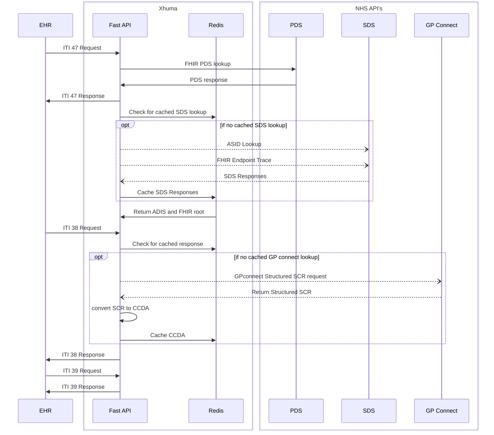

# Xhuma - GP Connect to CCDA Middleware Service

 [](https://coveralls.io/github/UCLH-Digital-Innovation-Hub/Xhuma?branch=main) [](https://github.com/UCLH-Digital-Innovation-Hub/Xhuma/actions/workflows/ci.yml)

## Overview

Xhuma is a stateless middleware service that facilitates the conversion of GP Connect structured records into CCDA (Consolidated Clinical Document Architecture) format. The service implements IHE ITI profiles for interoperability and uses Redis for efficient caching of responses.

### Key Features

- Stateless architecture for scalability and reliability
- Production-ready Redis caching with:
  - Memory management and persistence
  - Connection pooling and automatic retry
  - Comprehensive monitoring
- IHE ITI profile implementation (ITI-55, ITI-38, ITI-39)
- FHIR to CCDA conversion
- JWT-based authentication for NHS Digital services
- SOAP message handling for healthcare interoperability
- parsing of AMP/VMP GP prescriptions to true structured data using dm+d

## Technical Architecture

The service is built on FastAPI and follows a modular design pattern. For detailed technical documentation, see:

- [Technical Architecture](docs/technical_architecture.md)
- [Data Flow Documentation](docs/data_flow.md)
- [Technical Resources](docs/technical_resources.md)
- [Structured Dose Mapping](docs/dm+d_mapping.md)

## System Flow


```mermaid
sequenceDiagram
    participant EHR
    box Xhuma
    participant Fast API
    participant Redis
    end
    box NHS API's
    participant PDS
    participant SDS
    participant GP Connect
    end


    EHR->>Fast API: ITI 47 Request
    Fast API->>PDS: FHIR PDS lookup
    PDS->>Fast API: PDS response
    Fast API->>EHR: ITI 47 Response
    Fast API->>Redis: Check for cached SDS lookup
    opt if no cached SDS lookup
    Fast API--)SDS: ASID Lookup
    Fast API--)SDS: FHIR Endpoint Trace
    SDS--)Fast API: SDS Responses
    Fast API->>Redis: Cache SDS Responses
    end
    Redis->>Fast API: Return ADIS and FHIR root
    EHR->>Fast API: ITI 38 Request
    Fast API->>Redis: Check for cached response
    opt if no cached GP connect lookup
    Fast API--)GP Connect: GPconnect Structured SCR request
    GP Connect--)Fast API: Return Structured SCR
    Fast API->>Fast API: convert SCR to CCDA
    Fast API->>Redis: Cache CCDA
    end
    Fast API->>EHR: ITI 38 Response
    EHR->>Fast API: ITI 39 Request
    Fast API->>EHR: ITI 39 Response
```

## Prerequisites

- Docker
- Docker Compose
- NHS Digital API access credentials

## Development
1. install pipenv

2. install development dependencies
```bash
pipenv install --dev
```

3. install pre-commit hooks to ensure consistency
```bash
pre-commit install
```

4. configure environmental variables and use docker as below


## Deployment

1. Clone the repository:
```bash
git clone https://github.com/UCLH-Digital-Innovation-Hub/Xhuma.git
cd Xhuma
```

2. Set up environment variables:
```bash
cp .env.example .env
```

3. Configure the following in your .env file:
```
# Required configurations
REDIS_PASSWORD=your_secure_redis_password
API_KEY=your_api_key
JWTKEY=your_jwt_key
REGISTRY_ID=your_registry_id

# Optional configurations (defaults provided)
REDIS_HOST=redis
REDIS_PORT=6379
REDIS_DB=0
```

4. Deploy with Docker Compose:
```bash
docker-compose up -d
```

The service will be available at `http://localhost:8000`

## Azure Deployment (NHS TRE)

Infrastructure as Code (Terraform) and CI/CD pipelines (GitHub Actions) are provided for deploying to the NHS Azure TRE.

### Infrastructure
The `infra/` directory contains Terraform configuration for:
- Azure Web App for Containers (Linux)
- Azure Cache for Redis (Standard)
- Azure Monitor (Application Insights & Log Analytics)

### CI/CD Pipelines & Multi-Tenant Deployment
The pipeline implements a **"Shared-Nothing" Bootstrapped State Architecture**, designed to deploy isolated infrastructure per NHS Trust with zero manual engineering.

- **CI (`.github/workflows/ci.yml`)**: Runs code quality (Black, isort), CodeQL vulnerability scanning, and pytest suites. Triggers on `dev`, `int`, and `main`.
- **Infrastructure (`.github/workflows/infra.yml`)**: Dynamically routes deployments based on the triggering branch (`int` deploys to `rg-xhuma-int`, `main` deploys to `rg-xhuma-uclh-prd`). Automatically bootstraps an isolated Azure Storage Account for Terraform state (`tfstate`) within the target Resource Group before running Terraform.
- **Deployment (`.github/workflows/cd.yml`)**: Builds the Docker image, runs Trivy vulnerability scanning (CRITICAL/HIGH severities), pushes to GitHub Container Registry (GHCR), and deploys to the dynamically targeted Azure Web App.

### Observability
End-to-end traceability is implemented using **Azure Monitor OpenTelemetry**.
- Ensure `APPLICATIONINSIGHTS_CONNECTION_STRING` is set in the environment (configured automatically by Terraform).
- Logs and traces are correlated and sent to the Application Insights workspace.

### Prerequisites for Azure
1. Configure GitHub Secrets:
   - `AZURE_CREDENTIALS` (Service Principal JSON)
   - `AZURE_SUBSCRIPTION_ID`, `AZURE_TENANT_ID`, `AZURE_CLIENT_ID`, `AZURE_CLIENT_SECRET`
   - `RESOURCE_GROUP`
   - `API_KEY`, `JWTKEY`, `REGISTRY_ID`
   - `CR_PAT` (GitHub Personal Access Token for GHCR write access, if needed)

2. **Important**: You must run `pipenv lock` locally to update `Pipfile.lock` with the new `azure-monitor-opentelemetry` dependency before pushing.

## Redis Configuration

The service uses a production-ready Redis setup with:
- Memory management (256MB limit with volatile-lru policy)
- Data persistence (RDB snapshots and AOF)
- Connection pooling
- Automatic retry mechanism
- Comprehensive monitoring
- Security hardening

Redis metrics are available through Prometheus and can be visualized in Grafana.

## API Documentation

Access the interactive API documentation at:
- Swagger UI: http://localhost:8000/docs
- ReDoc: http://localhost:8000/redoc

## Branch Strategy

- `main`: Production releases (Triggers deployments to `rg-xhuma-uclh-prd` and future trust environments)
- `int`: Integration/Stabilization branch (Triggers deployments to `rg-xhuma-int` for dry runs)
- `dev`: Active development and feature integration
- `feature/*`: Feature branches

## Contributing

1. Create a feature branch from `dev`
2. Implement changes
3. Add tests
4. Create a pull request to `dev`

## Testing

Tests are automatically run in the CI pipeline. To run tests locally using Docker:

```bash
docker-compose -f docker-compose.test.yml up --build
```

## License

This project is licensed under the terms of the license included in the [LICENSE](LICENSE) file.
