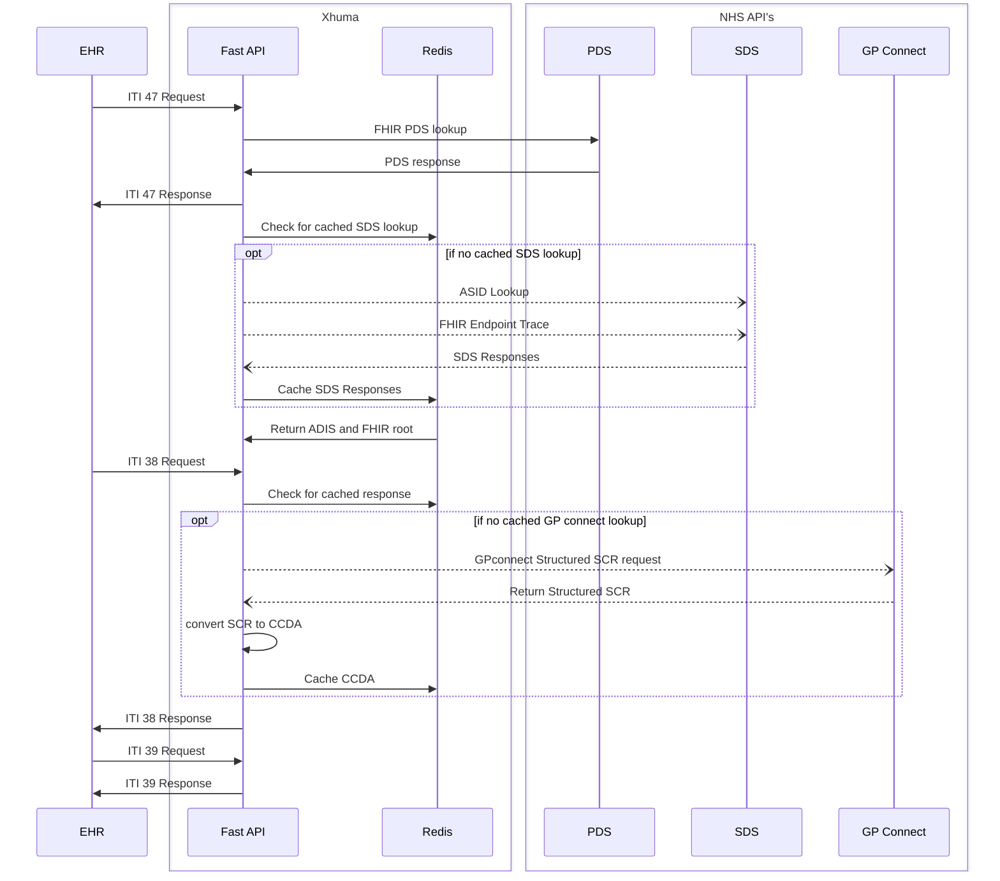

# Xhuma - GP Connect to CCDA Middleware Service


## Overview

Xhuma is a stateless middleware service that facilitates the conversion of GP Connect structured records into CCDA (Consolidated Clinical Document Architecture) format. The service implements IHE ITI profiles for interoperability and uses Redis for efficient caching of responses.

### Key Features

- Stateless architecture for scalability and reliability
- Redis-based caching for optimized performance
- IHE ITI profile implementation (ITI-47, ITI-38, ITI-39)
- FHIR to CCDA conversion
- JWT-based authentication for NHS Digital services
- SOAP message handling for healthcare interoperability

## Technical Architecture

The service is built on FastAPI and follows a modular design pattern. For detailed technical documentation, see:

- [Technical Architecture](docs/technical_architecture.md)
- [Data Flow Documentation](docs/data_flow.md)
- [Technical Resources](docs/technical_resources.md)

## System Flow



## Prerequisites

- Docker
- Docker Compose
- NHS Digital API access credentials

## Deployment

1. Clone the repository:
```bash
git clone https://github.com/UCLH-Digital-Innovation-Hub/Xhuma.git
cd Xhuma
```

2. Configure environment variables in docker-compose.yml:
```yaml
environment:
  - JWTKEY=your_jwt_key
  - REGISTRY_ID=your_registry_id
```

3. Deploy with Docker Compose:
```bash
docker-compose up -d
```

The service will be available at `http://localhost:8000`

## API Documentation

Access the interactive API documentation at:
- Swagger UI: http://localhost:8000/docs
- ReDoc: http://localhost:8000/redoc

## Branch Strategy

- `main`: Production releases
- `dev`: Development branch
- `feature/*`: Feature branches
- `integration`: Integration testing

## Contributing

1. Create a feature branch from `dev`
2. Implement changes
3. Add tests
4. Create a pull request to `dev`

## Testing

Tests are automatically run in the CI pipeline. To run tests locally using Docker:

```bash
docker-compose -f docker-compose.test.yml up --build
```

## License

This project is licensed under the terms of the license included in the [LICENSE](LICENSE) file.
