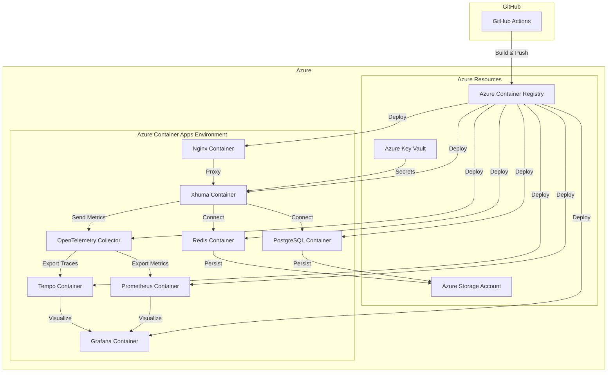

# Deploying Xhuma to Azure

This directory contains the configuration and scripts for deploying Xhuma to Azure using GitHub Actions and Azure Container Apps.

## Prerequisites

- Azure CLI installed
- Azure subscription
- GitHub repository with the Xhuma codebase
- Administrative access to the GitHub repository to add secrets

## Architecture

The deployment architecture consists of:

- **Azure Container Apps**: Hosts the containerized application
- **Azure Container Registry**: Stores container images
- **Azure Storage Account**: Provides persistent storage for Redis and PostgreSQL
- **Azure Key Vault**: Manages secrets and credentials



## Deployment Steps

### 1. Set Up Azure Infrastructure

Use the provided script to set up the Azure infrastructure:

```bash
# Make the script executable
chmod +x azure/deploy.sh

# Run the script with required parameters
./azure/deploy.sh \
  --resource-group <your-resource-group> \
  --acr-name <your-acr-name> \
  --storage-name <your-storage-name> \
  --keyvault-name <your-keyvault-name> \
  --location uksouth
```

### 2. Configure GitHub Secrets

After running the deployment script, you'll need to add the following secrets to your GitHub repository:

1. `AZURE_CREDENTIALS`: Service principal credentials (JSON output from `az ad sp create-for-rbac`)
2. `ACR_LOGIN_SERVER`: Your ACR login server URL
3. `ACR_NAME`: Your ACR name
4. `ACR_USERNAME`: Your ACR username 
5. `ACR_PASSWORD`: Your ACR password
6. `RESOURCE_GROUP`: Your Azure resource group name
7. `CONTAINER_APP_ENVIRONMENT`: Your Container App environment name
8. `STORAGE_ACCOUNT_NAME`: Your Azure Storage account name
9. `REDIS_PASSWORD`: Your Redis password
10. `POSTGRES_PASSWORD`: Your PostgreSQL password
11. `API_KEY`: Your Xhuma API key
12. `GRAFANA_ADMIN_PASSWORD`: Your Grafana admin password

### 3. Deploy the Application

Once all secrets are configured, the GitHub Actions workflow will automatically deploy the application when you push to the `main` or `dev` branches, or you can manually trigger a deployment from the Actions tab in your repository.

## Configuration Files

- `docker-compose.azure.yml`: Docker Compose configuration for Azure deployment
- `nginx/azure.conf`: Nginx configuration for Azure
- `nginx/Dockerfile`: Dockerfile for Nginx container
- `.env.azure.example`: Example environment variables for Azure deployment

## Monitoring and Management

Once deployed, you can monitor the application using:

- Azure Portal: Container Apps section
- Grafana dashboards: https://your-app-url/grafana/
- Prometheus metrics: https://your-app-url/metrics
- Tempo traces: https://your-app-url/tempo/

## Troubleshooting

If you encounter issues during deployment:

1. Check the GitHub Actions logs for errors
2. Verify that all GitHub secrets are correctly configured
3. Ensure your Azure resources have been properly provisioned
4. Check the application logs in the Azure Portal
5. Verify that your service principal has the necessary permissions

## Maintenance

For ongoing maintenance:

- Update container images by pushing to the repository
- Manage secrets in GitHub and Azure Key Vault
- Scale the application in the Azure Portal
- Monitor resources and usage in the Azure Portal

## Related Documentation

- [Azure Container Apps Documentation](https://docs.microsoft.com/en-us/azure/container-apps/)
- [GitHub Actions Documentation](https://docs.github.com/en/actions)
- [OpenTelemetry Documentation](https://opentelemetry.io/docs/)
