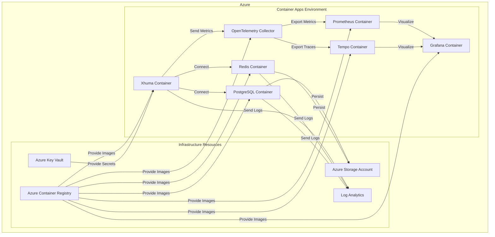

# Xhuma Azure Terraform Infrastructure

This directory contains the Terraform configurations to deploy Xhuma to Azure Container Apps.

## Architecture

The deployment creates the following Azure resources:

- **Azure Container Registry (ACR)**: Stores container images for Xhuma and other services
- **Azure Storage Account**: Provides persistent storage for Redis and PostgreSQL data
- **Azure Key Vault**: Manages secrets and credentials
- **Log Analytics Workspace**: Collects monitoring data
- **Container Apps Environment**: Hosts all container applications
- **Container Apps**: Xhuma, Redis, PostgreSQL, Prometheus, Grafana, OpenTelemetry Collector, and Tempo



## Prerequisites

- Terraform CLI installed (version 1.0.0 or higher)
- Azure CLI installed and logged in
- Azure subscription with permissions to create resources

## Configuration

### Environment Variables

Before running Terraform commands, you need to log in to the correct Azure tenant and subscription:

```bash
# Login to the UCLH Azure tenant
az login --tenant uclhaz.onmicrosoft.com

# Set the correct subscription
az account set --subscription rg-xhuma-play
```

### Variables

Configuration is managed through the following files:

- `variables.tf`: Defines the input variables
- Environment-specific values can be provided through:
  - Command-line flags (`-var="name=value"`)
  - Environment variables (`TF_VAR_name=value`)
  - `.tfvars` files

### Required Variables

| Variable | Description | Default |
|----------|-------------|---------|
| environment | Environment name (play, dev, test, prod) | play |
| location | Azure region | uksouth |
| redis_password | Password for Redis | (no default) |
| postgres_password | Password for PostgreSQL | (no default) |
| api_key | API key for Xhuma | (no default) |
| grafana_admin_password | Admin password for Grafana | (no default) |

## Deployment

### Manual Deployment

1. Initialize Terraform:
   ```bash
   terraform init
   ```

2. Validate the configuration:
   ```bash
   terraform validate
   ```

3. Plan the deployment:
   ```bash
   terraform plan -var="environment=play" -out=tfplan
   ```

4. Apply the plan:
   ```bash
   terraform apply tfplan
   ```

### GitHub Actions Deployment

The deployment can be automated using the GitHub Actions workflow defined in `.github/workflows/azure-deploy.yml`. This workflow:

1. Sets up Terraform
2. Initializes and validates the configuration
3. Plans and applies the Terraform configuration
4. Builds and pushes the Docker images to the created ACR


## Resource Naming Conventions

Resources follow the UCLH naming conventions:

- `<resource-type-abbreviation>-<project-shortname>-<environment>`
- Example: `cr-xhuma-play` for the Container Registry in the play environment

## Resource Tagging

All resources are tagged according to UCLH requirements:

- `CostCenter`: 240300
- `CreatedBy`: Xhuma Team (or the person creating resources)
- `Environment`: play, dev, test, or prod
- `git_origin`: Source repository URL
- `ManagedBy`: Terraform
- `Owner`: Xhuma Team
- `Service Hours`: none (or according to SLA)

## Clean Up

To destroy all created resources:

```bash
terraform destroy -var="environment=play"
```

**Note**: This will delete all resources including all data, so use with caution.
