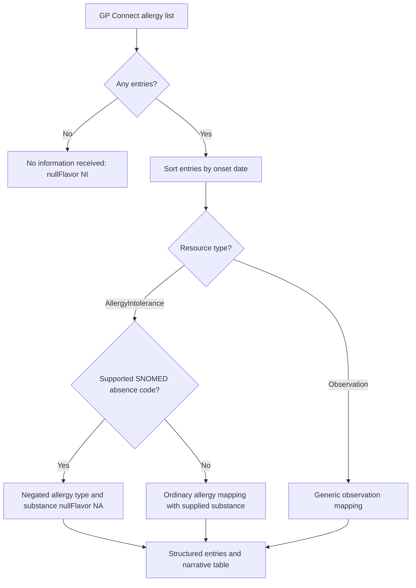

# Allergy Mapping overview

## Overview

GP Connect supplies allergy information as FHIR resources which Xhuma converts into the C-CDA allergies and adverse reactions section. The section contains a table for display and structured entries for the receiving system to process.

An allergy list can contain positive allergies, explicit statements that no allergies are known, or no entries. These have different meanings and must remain distinct during conversion. Xhuma follows the data returned by the GP system; it does not replace supplied codes, dates or statuses with values expected by a test pack.

Example FHIR no-known-allergy snippet, with the patient reference omitted:

```json
{
    "resourceType": "AllergyIntolerance",
    "clinicalStatus": "active",
    "verificationStatus": "unconfirmed",
    "code": {
        "coding": [
            {
                "system": "http://snomed.info/sct",
                "code": "716186003",
                "display": "No known allergy"
            }
        ]
    }
}
```

This is an explicit assertion that no allergy is known. It is not an allergy to a substance called “No known allergy”, and it is not the same as receiving an empty list.

## Options

### Copy the source code into the substance

For positive allergies, the supplied substance code belongs in the C-CDA substance participant. Applying that same approach to an absence code produces an ordinary positive allergy observation with “No known allergy” in the substance field. The displayed wording may be correct, but the structured meaning is not.

### Native C-CDA mapping

Xhuma recognises supported absence concepts using the SNOMED coding system and code, rather than the display text. Each concept maps to an allergy type with `negationInd="true"`. The scope remains specific to the source assertion. These mappings follow the [HL7 FHIR to C-CDA No Known Allergies concept map](https://hl7.org/fhir/us/ccda/en/ConceptMap-FC-NoKnownAllergies.html).

| FHIR SNOMED code | Source meaning | C-CDA observation value, negated |
| ---------------- | -------------- | ------------------------------- |
| 716186003 | No known allergy | 419199007 — Allergy to substance |
| 409137002 | No known drug allergy | 416098002 — Allergy to drug |
| 429625007 | No known food allergy | 414285001 — Allergy to food |

The required substance participant uses `nullFlavor="NA"`, since no particular allergen applies. This follows the [HL7 C-CDA 2.1 no-known-allergies example](https://cdasearch.hl7.org/examples/view/Allergies/No%20Known%20Allergies). Identifiers, dates, recorder, asserter and notes continue through the normal allergy mapping.

Abbreviated structured XML, showing the relevant fields only:

```xml
<observation xmlns:xsi="http://www.w3.org/2001/XMLSchema-instance"
             classCode="OBS" moodCode="EVN" negationInd="true">
    <code code="ASSERTION" codeSystem="2.16.840.1.113883.5.4"/>
    <statusCode code="completed"/>
    <value xsi:type="CD" code="419199007"
           displayName="Allergy to substance"
           codeSystem="2.16.840.1.113883.6.96"/>
    <participant typeCode="CSM">
        <participantRole classCode="MANU">
            <playingEntity classCode="MMAT">
                <code xsi:type="CE" nullFlavor="NA"/>
            </playingEntity>
        </participantRole>
    </participant>
</observation>
```

### Empty lists

An empty allergy list produces “No information received” in the table and a structured no-information entry using `nullFlavor="NI"`. Xhuma does not infer a no-known-allergy assertion from the absence of records.

### Basic flow



## Integration into the C-CDA Allergies section

### Active allergies

The GP Connect request sets `includeResolvedAllergies=false`. Current clinical validation is therefore scoped to active allergies. Xhuma converts the returned entries and displays their supplied statuses; it does not independently decide that an entry is resolved from its free text. Some test records described as resolved in the packs are returned by suppliers as active, which needs to be highlighted during validation.

### Display and dates

The table has six columns:

| Column | Content |
| ------ | ------- |
| Dates | Separate labelled lines for onset, assertion, last occurrence and reaction onset, when supplied |
| Description | Source coded description, with source text as a fallback |
| Status | Clinical status, verification status and criticality in the same cell |
| Reaction | Supplied reaction manifestations |
| Severity | Supplied reaction severities |
| Notes | Source notes, transfer-degraded allergy text where applicable, and the asserter when available |

Entries are ordered by onset date, oldest first. An onset period uses its start. Equal dates retain source order; entries without sortable onset dates appear last. Assertion dates are never substituted for missing onset dates. This ordering is explicitly commented in the converter.

Partial dates retain their supplied precision. Structured timestamps retain time and timezone where supplied, while narrative dates omit the time. Age, range and free-text onsets are displayed when present but are not turned into invented calendar dates. An onset period's end is a boundary on onset, not a resolution date.

### Structured information

Positive allergies use the supplied substance coding and available translations, with an allergy/intolerance type derived from the FHIR type and category. Reactions retain their associated severity observations. The recorder maps to a CDA author and the asserter to an informant. Source note text, note authors and note timestamps are retained where supplied. Assertion time is not assumed to be the recorder's authoring time.

Resource and business identifiers are preserved; identifier system URLs remain valid inputs to the existing root mapping. References to people are resolved from the bundle or contained resources without additional network calls. FHIR extensions without a natural CDA representation are not copied into custom observations or JSON payloads.

The displayed FHIR clinical and verification statuses should not be confused with CDA workflow status: the concern act is active and the observation is completed. The converter does not currently add separate structured observations for every displayed status or criticality value. Last-occurrence and non-calendar onset details are narrative fields rather than custom structured extensions.

### Risks and mitigations

An allergy may be recorded as a problem in the GP record rather than in the allergy list. In that case it may not appear in the C-CDA allergy section, so the section alone may not contain all recorded allergy information.

The converter adds the following note at the top of the C-CDA allergy section, above the table, including when the allergy list is empty:

> Some allergies may be recorded as problems.

This warning alerts the reader to the limitation; it does not identify or move allergy-related problems into the allergy section. Existing conversion warnings and supplier notes are retained below it.

| Risk/Problem | Handling or validation requirement |
| ------------ | ---------------------------------- |
| Allergy recorded as a problem rather than an allergy | Warning at the top of the C-CDA allergy section: “Some allergies may be recorded as problems.” |
| Empty list mistaken for no known allergies | Emit no information received, without inferring absence |
| Drug-only absence widened to all allergies | Use the specific absence-code mapping |
| Display text mistaken for an absence code | Match the SNOMED system and code only |
| Positive allergies coexist with an absence assertion | Preserve both records, their dates and notes; highlight the source conflict during clinical validation |
| Workbook differs from the returned bundle | Compare against actual supplier data and record discrepancies in the validation summary |
| Repeated allergies or notes | Preserve separate records and structured notes; do not reconcile or discard them |
| Missing asserter, dates, reactions or severity | Do not manufacture the missing information |
| Unmapped absence concepts, including environmental allergy | No special negation mapping is implemented; review any such source records before claiming coverage |
| Allergy information supplied as a FHIR Observation | Retain the generic observation path; the native absence mapping described here applies to AllergyIntolerance resources |
| Receiving system handles structured data differently | Verify import and interpretation in Epic as part of clinical validation |

## Validation

Automated tests cover native absence mappings, XML negation, the not-applicable substance, preservation of source details, and rejection of display-text-only or other-code-system matches. Empty lists remain distinct from explicit absence assertions.

The saved EMIS and TPP test bundles allow full CCDA conversion checks against the actual returned records. Supplier-data differences, including conflicting assertions, missing expected records and changed dates, belong in the clinical validation summary. Successful conversion and XML parsing do not establish Epic ingestion or clinical acceptance.
