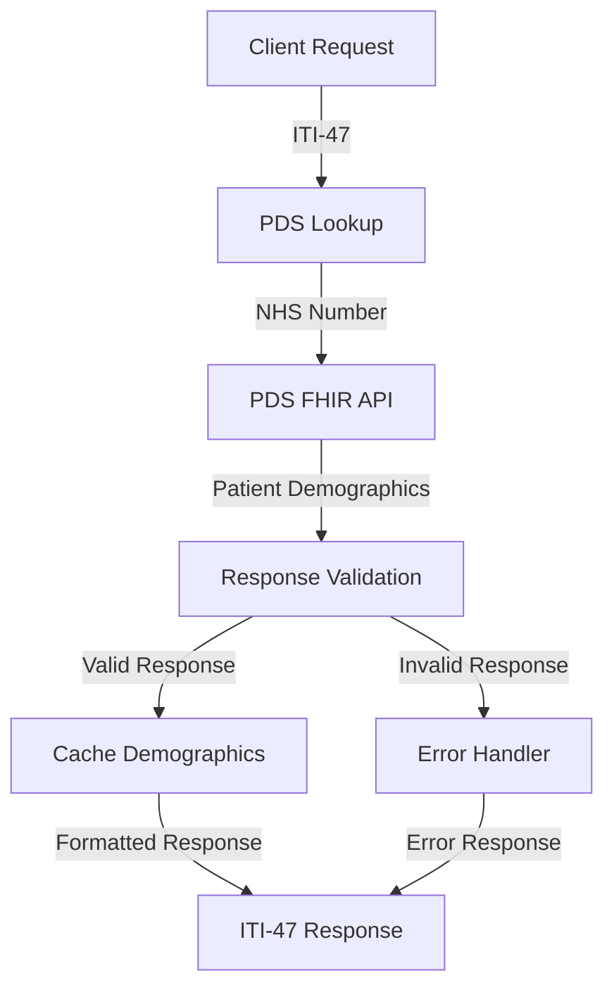
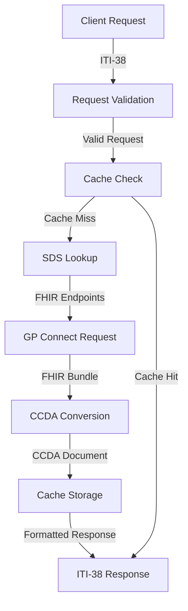
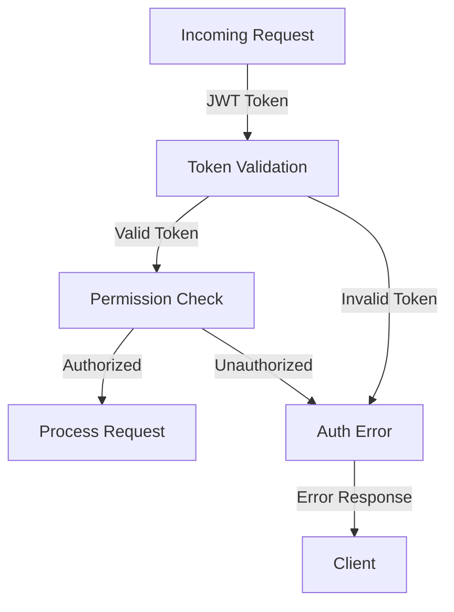
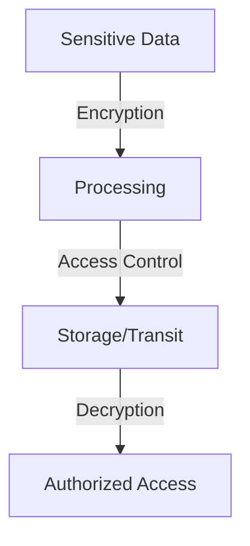

# Data Flow Documentation

## Overview
This document details the flow of data through the Xhuma middleware service, from initial request to final response, including all transformations and validations.

## Primary Data Flows

### 1. Patient Demographics Service (PDS) Flow


### 2. Structured Record Retrieval Flow


## Data Transformations

### 1. PDS Data Transformation
```
Input: NHS Number
↓
PDS FHIR API Call
↓
Raw Patient Demographics
↓
Validation & Formatting
↓
Output: Structured Patient Information
```

### 2. FHIR to CCDA Conversion
```
Input: FHIR Bundle
↓
Parse Bundle Structure
↓
Extract Clinical Entries
↓
Map to CCDA Templates
↓
Generate XML Structure
↓
Output: CCDA Document
```

## Data Validation Points

### Request Validation
- NHS Number format validation
- Token validation
- Request parameter validation
- Content-type verification

### Response Validation
- FHIR response structure validation
- Required field presence
- Data type conformance
- Business rule validation

## Caching Strategy

### Cache Keys
- `pds:{nhs_number}`: Patient demographics
- `sds:{org_code}`: SDS endpoint information
- `ccda:{nhs_number}`: Generated CCDA documents

### Cache TTL
- PDS Data: 24 hours
- SDS Endpoints: 12 hours
- CCDA Documents: 4 hours

## Error Handling Flow

### Error Categories and Responses
1. **Validation Errors**
   ```
   Invalid Input → Error Handler → Formatted Error Response
   ```

2. **API Errors**
   ```
   API Failure → Retry Logic → Error Handler → Error Response
   ```

3. **Transformation Errors**
   ```
   Failed Conversion → Error Handler → Error Response
   ```

## Security Flow

### Request Security Flow


### Data Protection Flow


## Integration Points

### NHS Digital Services
- PDS FHIR API
- SDS API
- GP Connect API

### External Systems
- Client EHR Systems
- Monitoring Systems
- Audit Systems

## Performance Considerations

### Request Flow Optimization
```
Client Request
↓
Load Balancer
↓
Cache Check
↓
API Request (if needed)
↓
Response Generation
↓
Client Response
```

### Concurrent Processing
- Async API calls
- Parallel transformations
- Batch processing capabilities

## Monitoring Points

### Data Collection Points
1. Request Entry
   - Timestamp
   - Request type
   - Client identifier

2. API Interactions
   - Response times
   - Success rates
   - Error rates

3. Cache Operations
   - Hit rates
   - Miss rates
   - Invalidation events

4. Transformations
   - Processing time
   - Success/failure rates
   - Resource usage

## Audit Trail

### Logged Events
1. Authentication attempts
2. Data access events
3. Transformation operations
4. Error occurrences
5. Cache operations

### Audit Record Structure
```json
{
    "timestamp": "ISO8601 DateTime",
    "event_type": "String",
    "actor": "String",
    "action": "String",
    "resource": "String",
    "status": "String",
    "details": "Object"
}
