# Data Flow Documentation

## Core Data Flows

### 1. Patient Demographics Service (PDS) Flow
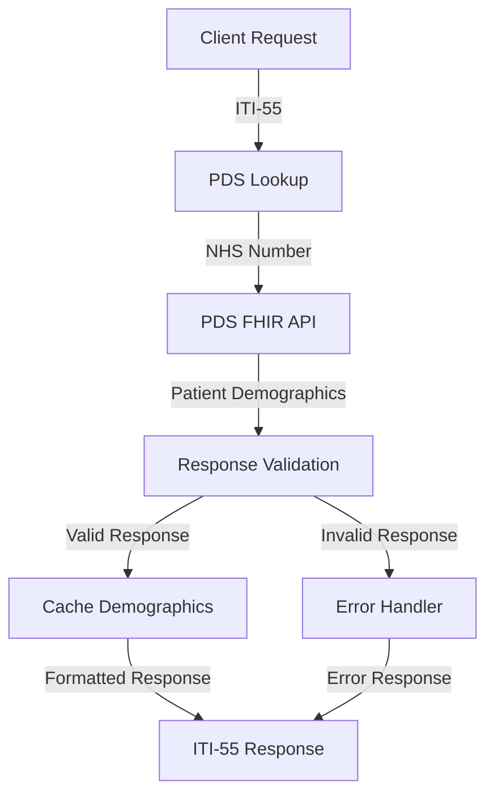
```mermaid
flowchart TD
    A[Client Request] -->|ITI-55| B[PDS Lookup]
    B -->|NHS Number| C[PDS FHIR API]
    C -->|Patient Demographics| D[Response Validation]
    D -->|Valid Response| E[Cache Demographics]
    E -->|Formatted Response| F[ITI-55 Response]
    D -->|Invalid Response| G[Error Handler]
    G -->|Error Response| F
```

### 2. Structured Record Retrieval Flow (ITI-38/ITI-39)
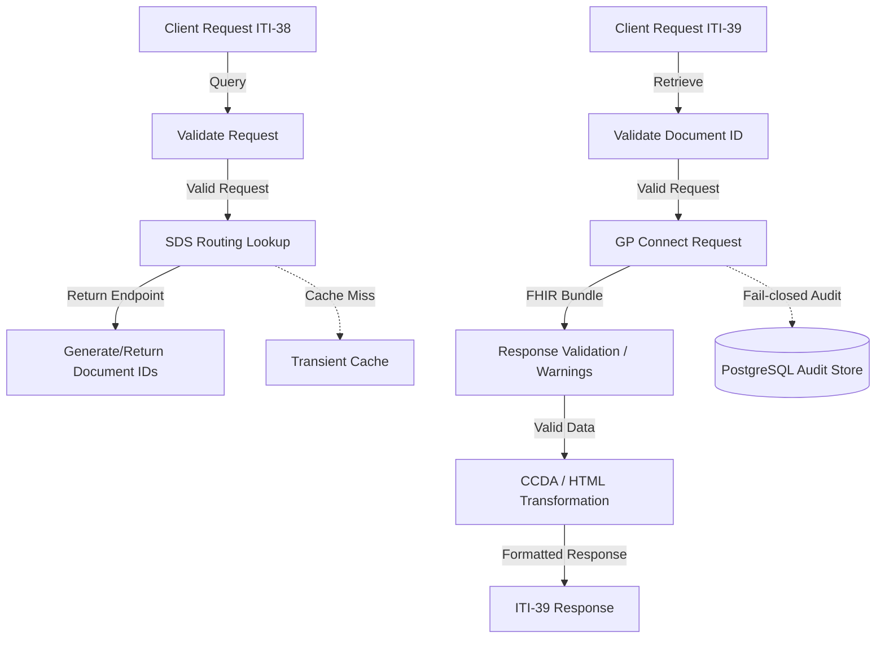
```mermaid
flowchart TD
    A[Client Request ITI-38] -->|Query| B[Validate Request]
    B -->|Valid Request| C[SDS Routing Lookup]
    C -->|Return Endpoint| D[Generate/Return Document IDs]
    
    E[Client Request ITI-39] -->|Retrieve| F[Validate Document ID]
    F -->|Valid Request| G[GP Connect Request]
    G -->|FHIR Bundle| H[Response Validation / Warnings]
    H -->|Valid Data| I[CCDA / HTML Transformation]
    I -->|Formatted Response| J[ITI-39 Response]
    
    C -.->|Cache Miss| Cache[Transient Cache]
    G -.->|Fail-closed Audit| Audit[(PostgreSQL Audit Store)]
```

## Observability Data Flows

### 1. Production Metrics Flow (Azure Monitor)
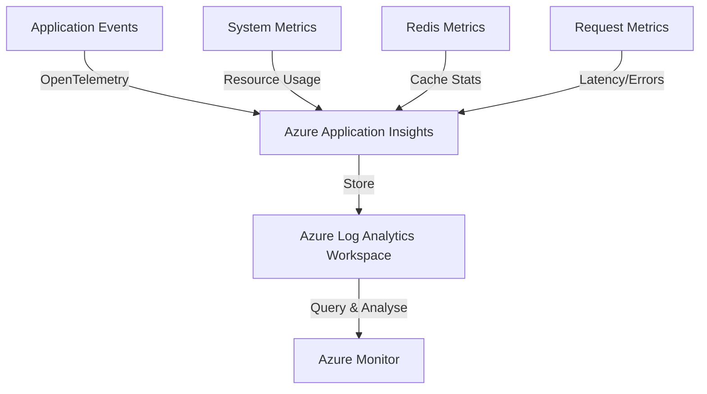
```mermaid
flowchart TD
    A[Application Events] -->|OpenTelemetry| B[Azure Application Insights]
    B -->|Store| C[Azure Log Analytics Workspace]
    C -->|Query & Analyse| D[Azure Monitor]

    G[System Metrics] -->|Resource Usage| B
    H[Redis Metrics] -->|Cache Stats| B
    I[Request Metrics] -->|Latency/Errors| B
```

### 1a. Local Development Metrics Flow (Docker Compose Only)
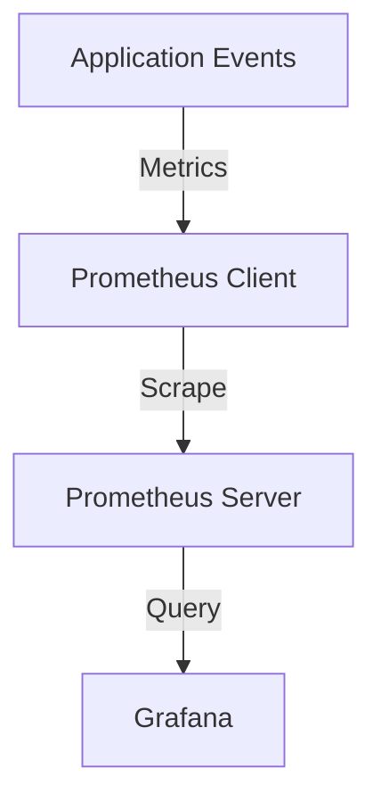
```mermaid
flowchart TD
    A[Application Events] -->|Metrics| B[Prometheus Client]
    B -->|Scrape| C[Prometheus Server]
    C -->|Query| D[Grafana]
```

### 2. Production Logging Flow (Azure Log Analytics)
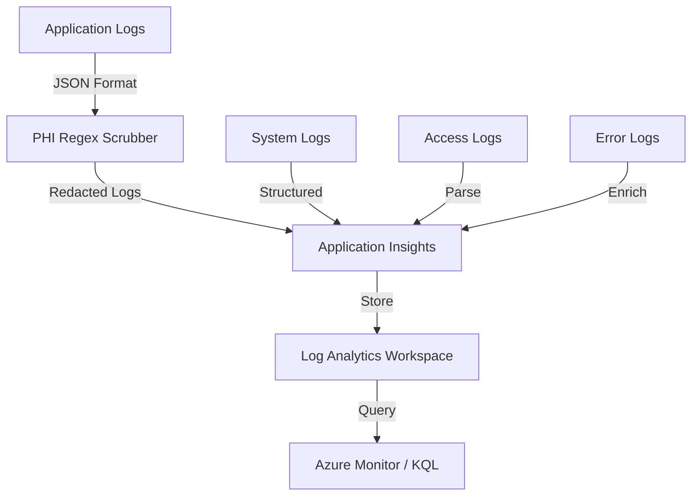
```mermaid
flowchart TD
    A[Application Logs] -->|JSON Format| B[PHI Regex Scrubber]
    B -->|Redacted Logs| C[Application Insights]
    C -->|Store| D[Log Analytics Workspace]
    D -->|Query| E[Azure Monitor / KQL]

    F[System Logs] -->|Structured| C
    G[Access Logs] -->|Parse| C
    H[Error Logs] -->|Enrich| C
```

### 3. Tracing Flow
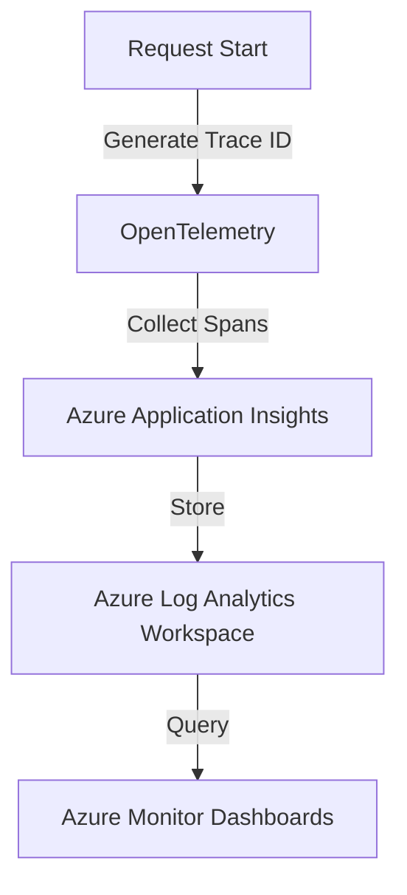
```mermaid
flowchart TD
    A[Request Start] -->|Generate Trace ID| B[OpenTelemetry]
    B -->|Collect Spans| C[Azure Application Insights]
    C -->|Store| D[Azure Log Analytics Workspace]
    D -->|Query| E[Azure Monitor Dashboards]
```

## Data Transformations

### 1. PDS Data Transformation
```
Input: NHS Number
↓
PDS FHIR API Call
↓
Raw Patient Demographics
↓
Validation & Formatting
↓
Output: Structured Patient Information
```

### 2. FHIR to CCDA Conversion
```
Input: FHIR Bundle
↓
Parse Bundle Structure
↓
Extract Clinical Entries
↓
Map to CCDA Templates
↓
Generate XML Structure
↓
Output: CCDA Document
```

## Monitoring Data Flows

### 1. Performance Metrics Flow
```
Request Start
↓
Timing Collection
↓
Metric Aggregation
↓
Azure Application Insights
↓
Azure Monitor Dashboards
```

### 2. Error Tracking Flow
```
Error Detection
↓
Error Classification
↓
Log Generation
↓
Alert Evaluation
↓
Notification Dispatch
```

## Cache Data Flow

### 1. Cache Operations
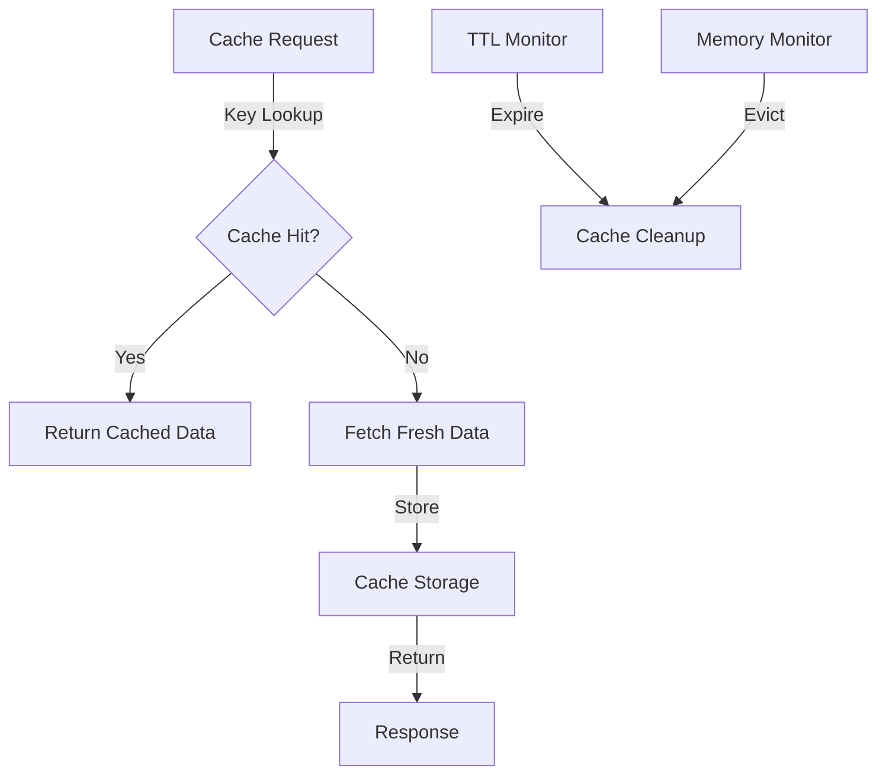
```mermaid
flowchart TD
    A[Cache Request] -->|Key Lookup| B{Cache Hit?}
    B -->|Yes| C[Return Cached Data]
    B -->|No| D[Fetch Fresh Data]
    D -->|Store| E[Cache Storage]
    E -->|Return| F[Response]

    G[TTL Monitor] -->|Expire| H[Cache Cleanup]
    I[Memory Monitor] -->|Evict| H
```

### 2. Cache Monitoring
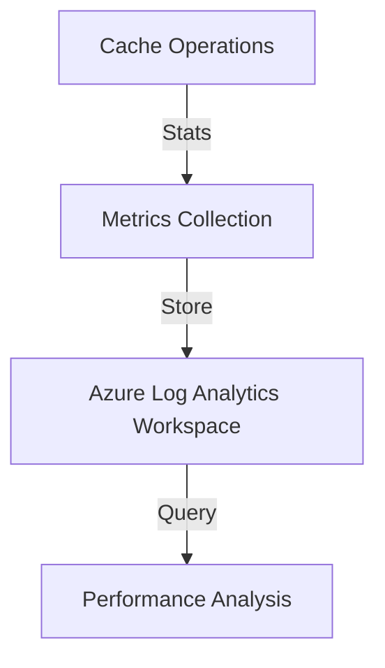
```mermaid
flowchart TD
    A[Cache Operations] -->|Stats| B[Metrics Collection]
    B -->|Store| C[Azure Log Analytics Workspace]
    C -->|Query| D[Performance Analysis]
```

## Security Data Flow

### 1. Authentication Flow
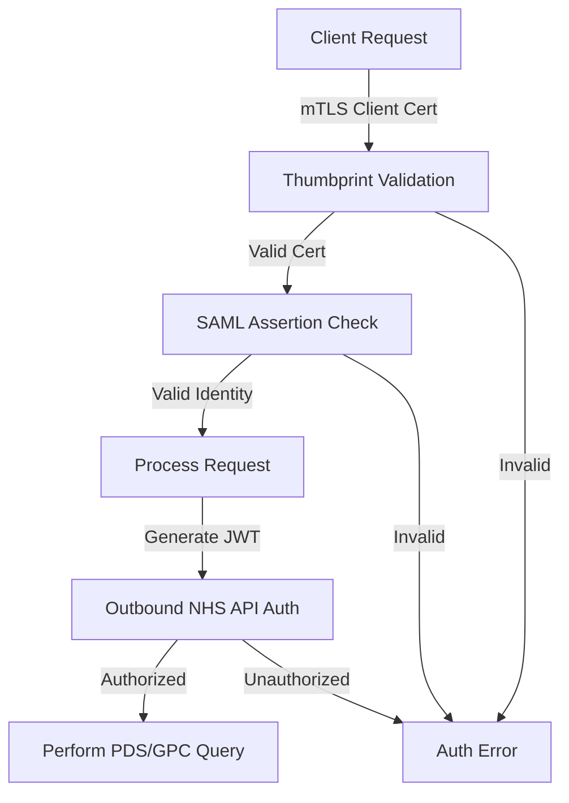
```mermaid
flowchart TD
    %% Inbound Trust
    A[Client Request] -->|mTLS Client Cert| B[Thumbprint Validation]
    B -->|Valid Cert| C[SAML Assertion Check]
    C -->|Valid Identity| D[Process Request]
    
    %% Outbound Trust
    D -->|Generate JWT| E[Outbound NHS API Auth]
    E -->|Authorized| F[Perform PDS/GPC Query]
    
    B -->|Invalid| G[Auth Error]
    C -->|Invalid| G
    E -->|Unauthorized| G
```

### 2. Audit Trail Flow
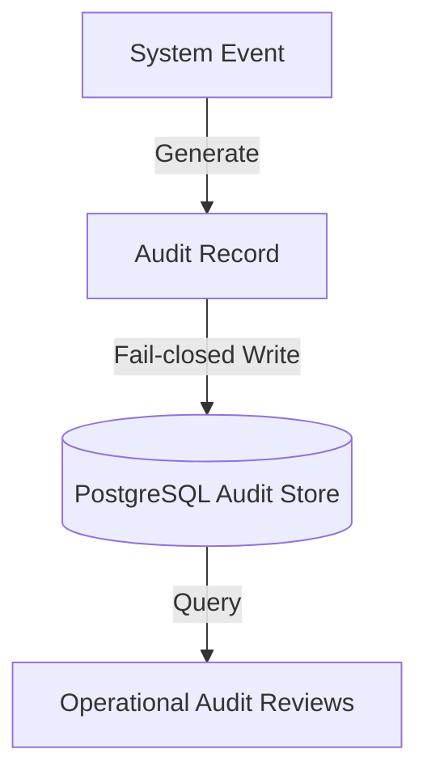
```mermaid
flowchart TD
    A[System Event] -->|Generate| B[Audit Record]
    B -->|Fail-closed Write| C[(PostgreSQL Audit Store)]
    C -->|Query| D[Operational Audit Reviews]
```

## Health Check Data Flow

### 1. System Health
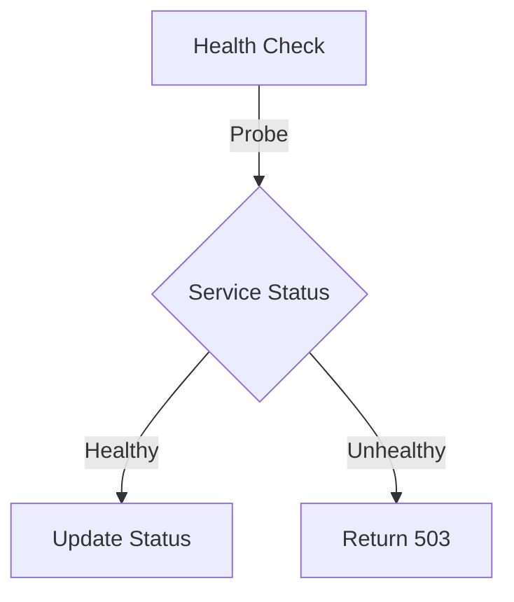
```mermaid
flowchart TD
    A[Health Check] -->|Probe| B{Service Status}
    B -->|Healthy| C[Update Status]
    B -->|Unhealthy| D[Return 503]
```

### 2. Dependency Health
```mermaid
flowchart TD
    A[Service Check] -->|Test| B{Dependencies (DB/Redis)}
    B -->|Available| C[Update Status]
    B -->|Unavailable| D[Log Error & Return 503]
```
