# Data Flow Documentation

## Core Data Flows

### 1. Patient Demographics Service (PDS) Flow


### 2. Structured Record Retrieval Flow


## Observability Data Flows

### 1. Metrics Collection Flow


### 2. Logging Flow


### 3. Tracing Flow


## Data Transformations

### 1. PDS Data Transformation
```
Input: NHS Number
↓
PDS FHIR API Call
↓
Raw Patient Demographics
↓
Validation & Formatting
↓
Output: Structured Patient Information
```

### 2. FHIR to CCDA Conversion
```
Input: FHIR Bundle
↓
Parse Bundle Structure
↓
Extract Clinical Entries
↓
Map to CCDA Templates
↓
Generate XML Structure
↓
Output: CCDA Document
```

## Monitoring Data Flows

### 1. Performance Metrics Flow
```
Request Start
↓
Timing Collection
↓
Metric Aggregation
↓
Prometheus Storage
↓
Grafana Visualization
```

### 2. Error Tracking Flow
```
Error Detection
↓
Error Classification
↓
Log Generation
↓
Alert Evaluation
↓
Notification Dispatch
```

## Cache Data Flow

### 1. Cache Operations

```mermaid
flowchart TD
    A[Cache Request] -->|Key Lookup| B{Cache Hit?}
    B -->|Yes| C[Return Cached Data]
    B -->|No| D[Fetch Fresh Data]
    D -->|Store| E[Cache Storage]
    E -->|Return| F[Response]
    
    G[TTL Monitor] -->|Expire| H[Cache Cleanup]
    I[Memory Monitor] -->|Evict| H
```


### 2. Cache Monitoring


## Security Data Flow

### 1. Authentication Flow


### 2. Audit Trail Flow


## Health Check Data Flow

### 1. System Health


### 2. Dependency Health
```mermaid
flowchart TD
    A[Service Check] -->|Test| B{Dependencies}
    B -->|Available| C[Update Status]
    B -->|Unavailable| D[Circuit Breaker]
    D -->|Activate| E[Fallback Mode]
    E -->|Log| F[Recovery Monitor]
