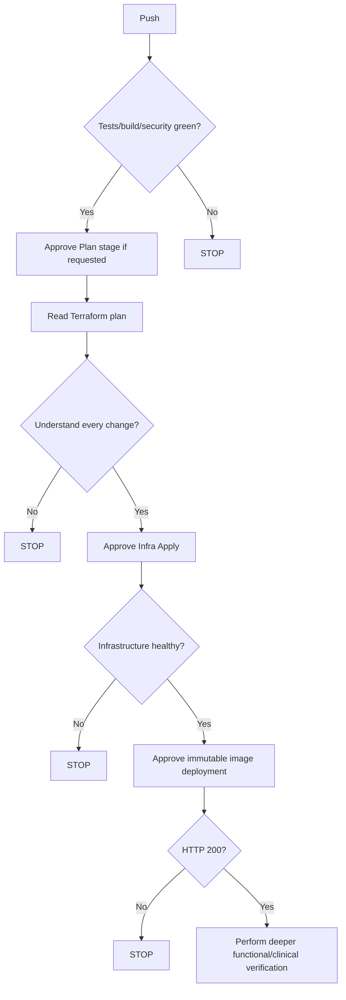

# Xhuma Deployment for Tired Humans

> [!IMPORTANT]
> **INT Migration Notice:** The `INT` environment is the first brownfield matrix migration.
> - It explicitly reuses existing `INT` Terraform state.
> - The `int-plan` GitHub Environment is protected during migration.
> - The existing-state preflight is mandatory and will block execution if state is missing.
> - The first plan is expected to include PostgreSQL audit convergence.
> - The existing custom domain `int.uclh.xhuma.co.uk` already exists and must survive.
> - `EPIC_CA_CERT` is already populated and resolved.
> - The `main`/`PRD` environment remains on the legacy pipeline and is untouched.

> The short version for when you need to deploy Xhuma without reading the entire Operator's Manual first.

> [!WARNING]
> This is a quick-start guide, not the authoritative technical runbook. If anything unexpected happens, stop and use the [Operator's Manual](./operators_manual.md).

## Before you touch anything

Check:
- you know which environment you are deploying;
- you know which branch/commit should be deployed;
- you are looking at the newest workflow run;
- there are no older/stale runs waiting for approval;
- you are not accidentally operating on INT or PRD.

Golden rule:

> If you don't understand why Terraform wants to change something, don't approve it.

## 1. Push the code

A push to a deployment branch starts the matrix pipeline.

Expected first stages:
- Prepare Targets
- CI & Tests
- Build & Push


*Figure 1 — CI & Tests stage confirming all tests pass before proceeding.*


*Figure 2 — Build & Push stage showing the immutable image build and Trivy vulnerability scan.*

Green = continue.
Red = stop and investigate.

## 2. GitHub may ask you to approve the Plan stage


*Figure 3 — Run #32 paused before `Infra Plan - play` because the `play-plan` GitHub Environment required reviewer approval.*


*Figure 4 — Plan-stage approval dialog — the operator explicitly selects `play-plan` and approves the protected environment before the workflow can continue.*

- click View / Review deployments;
- check `play-plan`;
- confirm this is the correct run/target;
- select the environment;
- approve.

*(Note: This pre-plan approval reflects the current configuration observed during the September 2026 Play rehearsal. It does not imply that every future environment must necessarily use a pre-plan approval gate.)*

## 3. Terraform tells you what it wants to do

X to add, Y to change, Z to destroy.


*Figure 5 — Play rehearsal plan showing 0 add / 15 change / 0 destroy.*

- **Add** = new resources.
- **Change** = existing resources will be modified.
- **Destroy** = resources will be deleted.
- **`0 destroy` DOES NOT automatically mean safe.**

During the Play rehearsal, the plan initially looked harmless (0 add / 15 change / 0 destroy), but deeper inspection found Terraform intended to remove externally managed tags, Azure-managed metadata, and an existing subnet service endpoint. Apply was rightfully withheld and the configuration was corrected. 

*(Note: A later Run #35 convergence plan returned no infrastructure changes after the Terraform ownership corrections).*

This is the main lesson of the guide.

## 4. Look at which resources are changing

The GitHub summary should show safe resource addresses/actions.

If further inspection is required, use the detailed [Operator's Manual](./operators_manual.md) rather than reproducing the complete advanced Terraform procedure. 

A safe command to list resources and actions is:
```bash
terraform show -json <plan> | jq -r '
  .resource_changes[]
  | select(.change.actions != ["no-op"])
  | "\(.change.actions | join(" -> "))\t\(.address)"
'
```

> [!WARNING]
> Never paste or publish the complete Terraform JSON plan because it can contain sensitive configuration.

## 5. The second approval is the important one


*Figure 6 — Infrastructure Apply approval gate — after Terraform Plan completes, Run #32 pauses at `rg-xhuma-play-infra`. The immutable plan hash, target and expected container digest remain visible before the reviewed plan can be applied.*

At this point:
- CI has passed;
- image has been built/scanned;
- Terraform Plan has completed;
- the exact plan has a SHA256 hash;
- Apply is still BLOCKED.

Before approving `rg-xhuma-play-infra` ask:
- Is this the correct target?
- Is this the correct commit/run?
- Do I understand every infrastructure change?
- Are there any deletes/replacements?
- Is anything from INT/PRD/shared infrastructure appearing unexpectedly?

If any answer is wrong or unclear: STOP.

## 6. Approve infrastructure

Only after the plan is understood. 

Apply consumes the saved/reviewed immutable plan rather than silently generating a different one.


*Figure 7 — Successful infrastructure Apply job completing after strict plan review.*

## 7. Approve the application deployment

Infrastructure and application deployment are deliberately separate gates. The application is deployed using the immutable SHA256 container digest built/scanned earlier.


*Figure 8 — Immutable application deployment.*

## 8. Ask the application if it is alive

```bash
curl -sS \
  -o /tmp/xhuma-health.json \
  -w 'HTTP %{http_code}\n' \
  https://<app_service>.azurewebsites.net/health

cat /tmp/xhuma-health.json
```

Expected:
```json
HTTP 200
{"status":"ok"}
```


*Figure 9 — Successful HTTP 200 health check.*

HTTP 200 means Xhuma is alive. It does NOT prove:
- GP Connect works;
- SOAP/mTLS works;
- audit is complete;
- every NHS/downstream dependency works;
- clinical acceptance is complete.

## 9. Environment onboarding before external connectivity

- [ ] custom domain bound and Secured
- [ ] DNS verification retained
- [ ] `epic-ca-cert` populated
- [ ] Key Vault reference Resolved
- [ ] `ALLOWED_HOSTS` appropriate
- [ ] relay endpoint configured
- [ ] health over intended FQDN
- [ ] SOAP/mTLS functional acceptance

*(Refer to the [Operator's Manual](./operators_manual.md) for precise steps).*

## 10. If something breaks

Simple rules:
- Don't randomly change Azure until you know why it failed.
- Don't generate a different Terraform plan and pretend it is the reviewed one.
- Don't approve unexplained drift.
- Don't expose secrets in screenshots/logs.
- Don't delete the target resource group because it contains Terraform state/bootstrap infrastructure.
- If unsure, stop and use the full [Operator's Manual](./operators_manual.md).

## 11. The 30-second version



> **Tired-person rule:** stopping a deployment is reversible. Approving a change you don't understand may not be.

---
*For authoritative procedures, refer to the [Operator's Manual](./operators_manual.md).*
