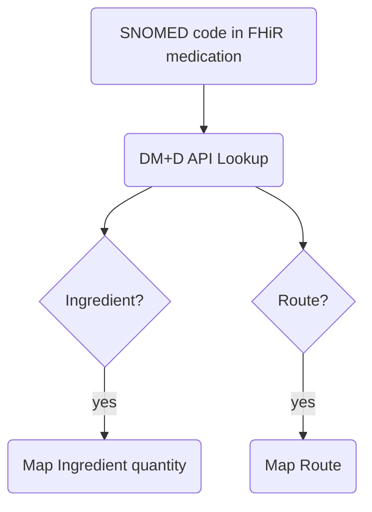
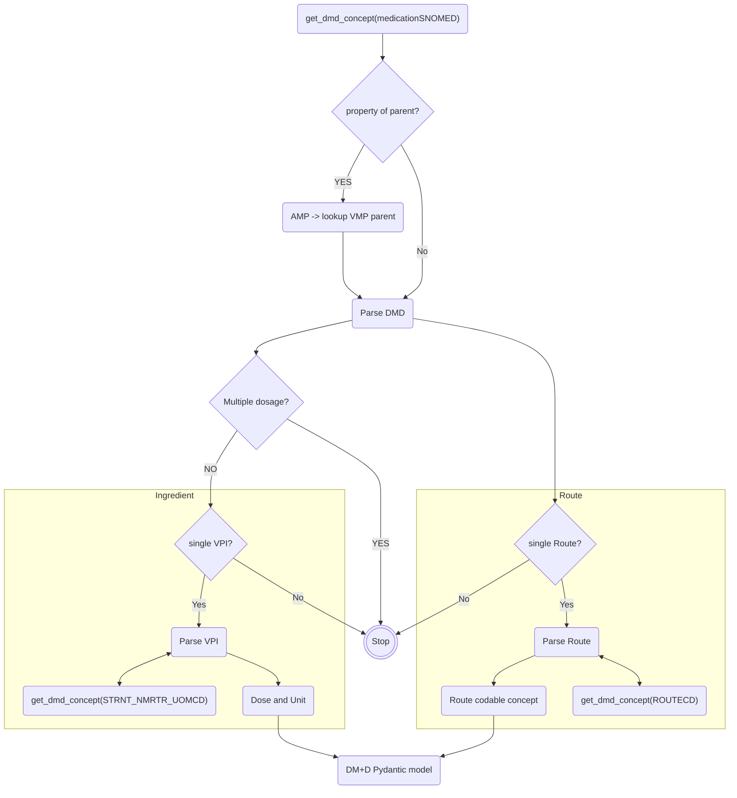

# DM+D Mapping overview

## Overview

Structured medication prescription data from GP systems is limited in that GP's prescribe fixed quantities of a specific medicinal product. This results in almost all structured doses being in the form of a integer quantity of tablet or capsule.

Example fhir dosage snippet:
```json
"dosageInstruction": [
                    {
                        "text": "1 tablet, daily",
                        "timing": {
                            "repeat": {
                                "frequency": 1,
                                "period": 1,
                                "periodUnit": "d"
                            }
                        },
                        "doseQuantity": {
                            "value": 1,
                            "unit": "tablet",
                            "system": "http://snomed.info/sct",
                            "code": "428673006"
                        }
                    }
                ],
```

As we can see from this typical example the dose quantity is for a single tablet rather then for a dose of drug in units such as mg and so will not map naturally to secondary care prescribing systems. We also do not have a route but this is typically "take" for prescriptions originating in GP systems and again does not map.

## Options

### REGEX
One potential solution would be to use regular expressions to identify the dose within the text of the drug name. For many commonly prescribed medications this would be relatively trivial e.g. the following coded medication could trivially be parsed to 15mg
 ```json
 "code": {
                    "coding": [
                        {
                            "system": "https://fhir.hl7.org.uk/Id/emis-drug-codes",
                            "code": "LAOR14898NEMIS",
                            "display": "Lansoprazole 15mg orodispersible tablets",
                            "userSelected": true
                        },
                        {
                            "system": "http://snomed.info/sct",
                            "code": "4053411000001103",
                            "display": "Lansoprazole 15mg orodispersible tablets"
                        }
                    ]
                }
 ```
However at the scale of the entire UK drug catalogue and taking into account the various medications that are mixtures then any expression would rapidly become unwieldy and introduce significant risk into the process

### DM+D
The Dictionary of Medicines and Devices is an assured dictionary or medicines and devices that are used within the NHS. It allows for mapping of drugs from virtual medicinal products to their base ingredients as well as provides additional information such as their appropriate chapter in the BNF, controlled drug status and other information such as tariff information.

Importantly DM+D also includes the specific quantity of drug and unit in an assured way as well of a list of approved routes.

There are two ways of consuming DM+D. Data is released weekly via the TRUD service which is free to sign up to, [Mark Wardle](https://github.com/wardle/dmd) has written an excellent microservice that simplifies integration. Additionally the [NHS Terminology Server](https://digital.nhs.uk/services/terminology-server) is a platinum level service that allows for real time queries of DM+D as well as SNOMED.

Xhuma uses the Terminology server for DM+D queries

### Basic flow



### Risks and mitigations

Mapping doses still presents a number of risks. Many medications have several ingredients and a number of routes so simple mapping flows risk introducing errors. Additionally mapping and calculation of doses is only desired for medications that are prescribed in the form of "1 tablet"

| Risk/Problem          | Mitigation |
| --------------------- | ----------- |
| Drug with multiple ingredients      | Only map doses with single ingredients       |
| Drug with multiple routes   | Only map routes with single approved route        |
| Drug prescribed as AMP rather than VMP   | Check if AMP, is so then map parent        |
| Only medications with unitless quantity to be mapped   | Only map doses if unit "tablet", "capsule" or None       |
| More then one dosage instruction  | Stop if len(dosage) == >1      |


### Final Flow


