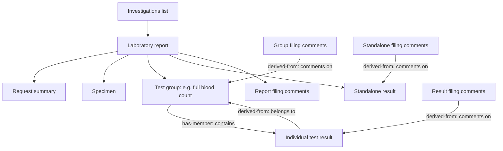

# How investigation results are grouped

## Purpose

A laboratory report can contain several groups of tests, individual results and comments added when a clinician files the report. We want the summary to preserve those relationships without losing results that arrive in an unusual format.

**We identify a test group from the links supplied by the GP system. A test name, an empty value or its position in a list is not enough to establish a group.**

This document describes the implemented grouping behaviour. It follows the [GP Connect investigations guidance, version 1.6.2](https://simplifier.net/guide/gp-connect-access-record-structured/Home/Design/Investigations-guidance?version=1.6.2) and the linked [Observation population guidance](https://simplifier.net/guide/gpconnect-data-model/Home/FHIR-Assets/All-assets/Profiles/Profile--CareConnect-GPC-Observation-1?version=current). The latter link is maintained as the current profile, rather than a fixed 1.6.2 snapshot.

## What arrives from the GP system

| Clinical concept | Name in the incoming FHIR data | Meaning |
| --- | --- | --- |
| Report | `DiagnosticReport` | The report that holds the results together |
| Test group | `Observation` | A panel or profile, such as full blood count |
| Individual result | `Observation` | An individual test, whether grouped or standalone |
| Filing comment | `Observation` | Information recorded when a report, group or result is filed |
| Specimen | `Specimen` | Information about the sample |
| Request summary | `ProcedureRequest` | Summary of the original request |

Group headings, results and filing comments all arrive as Observations. Their shared name does not mean they have the same clinical role.



The arrows describe relationships, not the order of items in the incoming message. The original report document and supporting images are outside the scope of this GP Connect version. Patient and clinician attribution are omitted from the diagram for readability.

## The decision process

1. **Keep each report separate.** Reports are not merged because they share a laboratory number or date.
2. **Read the supplied links.** A group can point to its results, and a result can point back to its group. Either direction provides evidence of membership.
3. **Separate filing comments from tests.** A comment linked to a result does not turn that result into a panel.
4. **Display the group and its members together.** Keep group comments with the group and result comments with the result. Show report-level filing comments separately.
5. **Keep ungrouped content.** If there is no evidence of membership, retain the observation without assigning nearby results to it.
6. **Show available information when links are broken.** Do not silently discard a report because some relationships cannot be resolved.

Source reference order is retained where possible, but grouping brings related items together. No clinical relationship is inferred from bundle entry order, matching timestamps or similar names.

## Reading the examples

The examples below are shortened, invented FHIR fragments. They show only the fields needed to explain grouping and are not complete patient records. Names such as `fbc` and `hb` are local labels used to link items together.

- `has-member` means “contains this result”.
- `derived-from` means “belongs to this group” for a result, or “comments on this item” for a filing comment in this GP Connect model.
- `reference` identifies the other item. It is not a clinical value.

### A panel with individual results

The FBC heading points to haemoglobin. Haemoglobin points back to FBC.

```json
[
  {
    "resourceType": "Observation",
    "id": "fbc",
    "code": {"text": "Full blood count"},
    "related": [{"type": "has-member", "target": {"reference": "Observation/hb"}}]
  },
  {
    "resourceType": "Observation",
    "id": "hb",
    "code": {"text": "Haemoglobin"},
    "valueQuantity": {"value": 137, "unit": "g/L"},
    "related": [{"type": "derived-from", "target": {"reference": "Observation/fbc"}}]
  }
]
```

**Summary behaviour:** display “Test group: Full blood count”, followed by haemoglobin. The two arrows describe one relationship; they do not produce two haemoglobin results. If only one direction is present, the available link is still used.

The same approach handles multiple panels in one report. Each gets its own heading and linked results. The report itself remains one report.

### A result with an attached filing comment

Here the comment points to haemoglobin. The comment code identifies its role; it is not another blood test.

```json
{
  "resourceType": "Observation",
  "id": "filing-note",
  "code": {
    "coding": [{"system": "http://snomed.info/sct", "code": "37331000000100"}]
  },
  "comment": "Discussed with patient; repeat as planned.",
  "related": [{"type": "derived-from", "target": {"reference": "Observation/hb"}}]
}
```

**Summary behaviour:** place the comment with haemoglobin. Do not create a group simply because a result has a comment attached. Some supplier messages instead link from the result to the comment using `has-member`; this association is also recognised.

A comment directly referenced by the report, with no result/group association, is displayed as report-level filing information. A filing comment can contain a coded value identifying the test that was filed: that value must not be treated as a new analyte result. This grouping change does not add a complete mapping of filing dates, authors or coded filing values.

### A standalone result expressed in words

```json
{
  "resourceType": "Observation",
  "id": "inr",
  "code": {"text": "International normalised ratio"},
  "valueString": "Ap 2.400",
  "comment": "Treatment bands supplied by the laboratory."
}
```

**Summary behaviour:** retain the result and its comment. A result does not have to contain a numeric quantity to count as a result. In the saved EMIS example, the old heading rule dropped this INR result; relationship-based grouping retains it.

A result can also exist entirely in a comment:

```json
{
  "resourceType": "Observation",
  "id": "oestradiol",
  "code": {"text": "Oestradiol"},
  "comment": "Result 8.8; units and reference information supplied in source text."
}
```

The text is retained. The converter does not extract a new numeric measurement from this prose.

### A report supplied as a flat list

```json
{
  "resourceType": "DiagnosticReport",
  "id": "report-1",
  "result": [
    {"reference": "Observation/chemistry-heading"},
    {"reference": "Observation/sodium"},
    {"reference": "Observation/potassium"}
  ]
}
```

If these Observations contain no membership links, the list alone does not establish that sodium and potassium belong to the apparent chemistry heading.

**Summary behaviour:** retain all three observations in the supplied report order. Do not invent a group. This matters for the saved TPP data, where many reports are flat. A familiar panel name is not enough to reconstruct the original layout confidently.

### A transferred record with a degraded heading

Records transferred between systems may have a generic transfer code while preserving the original heading as text.

```json
{
  "resourceType": "Observation",
  "id": "transferred-fbc",
  "code": {
    "coding": [{"system": "http://snomed.info/sct", "code": "196411000000103"}],
    "text": "Full blood count - FBC"
  },
  "related": [{"type": "has-member", "target": {"reference": "Observation/hb"}}]
}
```

**Summary behaviour:** use the supplied text for the group heading and follow its result links. Individual transfer-degraded results also retain their original names in the result rows and in the structured code’s `originalText`; the supplied code and its coded display remain unchanged. The transfer code does not prevent grouping. The saved EMIS FBC example demonstrates why this matters: skipping a degraded heading can hide its child results.

## Unusual or incomplete relationships

| Situation | Summary behaviour |
| --- | --- |
| A group contains another group | Follow the links recursively and show both headings with their results |
| The same result belongs to two groups | Show the result once within the report and an “Also associated” note at the other location |
| A group unexpectedly contains its own value | Keep the heading, members and the supplied value through the existing value converter |
| A link points to an unavailable observation | Show available content and a notice that some relationships could not be resolved; do not invent the missing result |
| Links form a loop | Stop following the loop, show available items once and display a grouping notice |
| An observation cannot be placed under a normal heading | Retain it under “Unplaced source item” |
| A link would pull in an item directly assigned only to another report | Keep the reports separate and flag the unresolved association |

Zero and false count as supplied values when deciding whether a group has content to retain. This does not mean every FHIR value type has a completed CDA mapping; value conversion is a separate concern.

## What this change does and does not establish

The readable CCDA section now shows the detected groups and associated comments. Each source report still produces one CCDA organizer (the structured container for that report). Individual result components remain flat inside it: this change does not introduce nested CDA organizers or claim that Epic will reconstruct every displayed group from structured data alone.

The earlier report-caption and category-selection rules remain for this change. A caption may therefore be less descriptive than the group headings beneath it. Result rows use four fixed columns: component, value, reference range and comments. Headings and annotations span all four columns. Reference-range mappings are unchanged. The date mapping is explained below. Result value mapping is described below. Report conclusions now appear above the report’s results table. Notes from specimens referenced by that report appear in a separate “Specimen notes” table beneath it, labelled with specimen type and identifier where supplied. Multiple notes and their line breaks are retained. These conclusions and specimen notes are narrative additions, not invented test results. The incomplete-record-transfer warning and other previously identified metadata gaps remain separate work.

The [comparison CCDAs](assurance/evidence/investigation-grouping-comparison/README.md) show the reviewed before-and-after behaviour. The [assessment](assurance/evidence/2026-09-29-investigations-assessment.md) records the original findings and wider converter issues; it is historical evidence rather than a description of the current grouping code.

For clinical review, check that group headings describe their linked tests, comments remain with the correct result or group, transferred headings retain their children, and flat reports do not imply unsupported relationships. A successful XML conversion alone does not confirm clinical correctness or Epic display behaviour.

## Laboratory status mapping

The structured CCDA status describes laboratory progress, not whether the GP has reviewed or filed the report. This mapping does not filter out non-final reports or change the separate Epic finalised-results policy.

| Incoming FHIR status | CDA status |
| --- | --- |
| `registered`, `partial`, `preliminary` | `active` |
| `final`, `amended`, `corrected`, `appended` | `completed` |
| `cancelled` | `aborted` |
| `entered-in-error` | Organizer: `nullified`; individual result: `nullFlavor="OTH"`, with the original status displayed in its comments and structured text |
| `unknown` or missing | `nullFlavor="UNK"`, without a code |
| An unrecognised value | `nullFlavor="OTH"`; individual result status retained in comments and structured text |

The mappings are implementation choices based on the [FHIR STU3 report status definitions](https://hl7.org/fhir/STU3/codesystem-diagnostic-report-status.html) and [CDA result status guidance](https://hl7.org/fhir/us/ccda/en/ConceptMap-CF-ResultStatus.html). FHIR cancellation does not distinguish cancellation before work starts from abandonment after work starts; `aborted` is used conservatively. Corrections and amendments occur after finalisation. The restricted CDA Result Status vocabulary does not include `nullified`, so a withdrawn individual result uses an explicit non-mappable status and visible source wording. Unknown is never converted to completed.

## Result values

The value converter produces structured CDA and the matching “Value” cell together. It keeps supplied numbers and words; it does not extract a new measurement from a comment.

| Source value | Structured CDA | Readable result |
| --- | --- | --- |
| Quantity | `PQ` | Source number and unit wording |
| Quantity with a comparator | `IVL_PQ` | Source comparator, number and unit wording |
| String | `ST` text content | Original text, including line breaks |
| Coded concept | `CD`, original text and additional codings where representable | Original text or supplied display/code |
| Boolean | `BL` | True or False, including a supplied false |
| Integer, if exposed by the input model | `INT` | Integer, including zero; the current STU3 Observation model does not accept `valueInteger` in incoming JSON |
| Range | `IVL_PQ` | Supplied bounds and their units |
| Ratio | `RTO_PQ_PQ` | Numerator and denominator, with their respective units |

For upper-bound quantities, the agreed zero lower-bound convention is retained. Strict `<` and `>` bounds explicitly use `inclusive="false"`; `<=` and `>=` use `inclusive="true"`. If zero would create an inverted or empty interval (for example `< -5` or `< 0`), the original quantity is retained as labelled unmapped text for review. Actual FHIR Range values retain only their supplied bounds. These choices follow the [HL7 quantity mapping guidance](https://build.fhir.org/ig/HL7/ccda-on-fhir/en/mappingGuidance.html#ranges-of-physical-quantities).

A supplied UCUM code is used for the structured unit while the source wording remains in the table. Where UCUM is not declared, only a small set of recognised unit spellings is accepted directly. Other units, or missing units, retain the magnitude and source wording in a CDA quantity translation. This is deliberately not a general unit-conversion service and does not assume a missing unit means dimensionless.

Known coding systems and explicit OIDs are retained as CDA codes. Codes without a known OID are preserved as labelled source text in translations rather than inventing a coding system. Text-only concepts use an explicit null flavour and original text.

Where a data-absent reason is supplied, the readable result explains it and the CDA carries a corresponding null flavour. A missing quantity is not zero. A comment-only observation without a separate value remains comment-only. Unsupported value types (including attachments, sampled data and date/time values) and malformed ratios are retained as labelled source text and logged for review, rather than decoded or discarded. This preserves content but does not promise that Epic can process it as that original datatype. An empty string is explicitly shown as such.


## Specimens, authors and dates

The structured report can contain several specimens and several authors. Specimens retain their source identifiers and coded sample type, such as serum. Supporting several authors in the model does not make a laboratory performer an author: authorship still requires source evidence of that role.

Section 7 of *Requirements to Enable Happy Together Labs for Other Vendors* gives the two result timestamps different meanings:

| CCDA location | Meaning for Epic | Source used |
| --- | --- | --- |
| Report organizer effective time | Specimen collection time | The referenced specimen's collected date/time or collection period |
| Each result observation's effective time | The report's finalising instant, shared by all components | DiagnosticReport.issued, as the available report issue-time proxy |
| Author time | When the author authored the information | Authorship information, when supplied; this is separate from both laboratory timestamps |

An issue timestamp is not proof that a report is final. This mapping does not introduce a new finalised-results filter. Laboratory receipt time and GP filing time are not substituted for collection or finalisation.

The organizer time has both a lower and an upper bound. For a single collection instant they are equal. For a collection period they retain its start and end; an absent endpoint is explicitly unknown. If several specimens share the same collection interval, that interval can be used. If their collection times differ, a specimen cannot be resolved, or no collection time is supplied, the organizer has unknown bounds rather than an arbitrarily selected date. Individual collection and receipt dates remain visible in the specimen table beneath the results, alongside the specimen notes.

Dates retain their supplied precision and timezone. A year-only date stays a year; it is not turned into 1 January. Missing report issue time stays unknown for every component rather than borrowing an individual test's date.

This follows Epic's collection-time interpretation of the organizer. The general [C-CDA Result Organizer definition](https://build.fhir.org/ig/HL7/CDA-ccda-2.1-sd/StructureDefinition-ResultOrganizer.html) describes its effective time as spanning its component observations instead. The model comments make this distinction explicit so that the Epic mapping is not accidentally replaced by a different interpretation.
