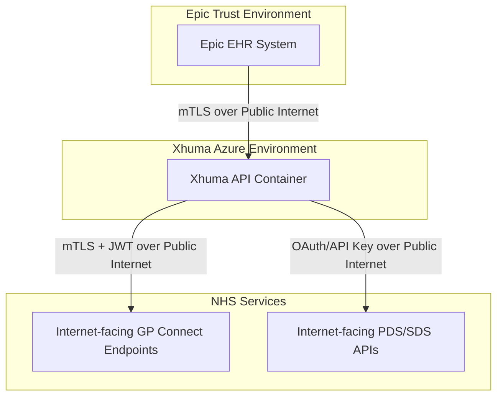

# General Network & Infrastructure Architecture

This document provides an overview of the Xhuma middleware network architecture. It details the Azure cloud infrastructure, CI/CD deployment pipelines, API dependencies, and the specialised networking models required for secure NHS integration (including both current HSCN and future public internet states).

## 1. Cloud Infrastructure (Azure)

Xhuma's cloud infrastructure is provisioned via Terraform (`infra/main.tf`). The infrastructure is hosted on Microsoft Azure within a centralised Resource Group.

### Azure Components
* **App Service (Linux Web App):** The main API container host. It runs the Dockerised FastAPI application and serves incoming HTTP/SOAP traffic over TLS. WebSockets are enabled to support outbound tunnelling.
* **PostgreSQL Flexible Server:** Provides persistent relational storage for audit logging and service configuration. It is protected by internal Azure firewall rules.
* **Redis Cache:** A managed memory cache used for storing transient data such as NHS OAuth Tokens, PDS demographic lookups, and generated CCDA documents to reduce redundant NHS API calls.
* **Observability:** Azure Application Insights and a Log Analytics Workspace are used to store OpenTelemetry metrics, traces, and application logs.

---

## 2. CI/CD Deployment Flow

Xhuma uses GitHub Actions (`.github/workflows/cd.yml`) for automated deployment.


1. **Build:** Commits to protected branches trigger the CD pipeline. The runner builds a new Docker image from the working directory.
2. **Registry:** The built image is tagged with the Git SHA and pushed to the GitHub Container Registry (`ghcr.io/uclh-digital-innovation-hub/xhuma`).
3. **Deploy:** The pipeline authenticates to Azure and commands the `xhuma-app-prod` Azure Web App to pull the latest image and update the deployment, which includes running Alembic database migrations on startup.

---

## 3. Application Programming Interfaces (APIs)

Xhuma acts as a translator between inbound Epic SOAP transactions and outbound NHS FHIR REST APIs.

### 3.1 Inbound Integrations (Epic -> Xhuma)
The Trust's Epic EHR connects to Xhuma over the public internet utilising mutually authenticated TLS (mTLS). Xhuma provides a SOAP-compliant FastAPI router (`app/soap/routes.py`) that handles standard IHE ITI Profiles:
* **ITI-47 / ITI-55:** Patient Demographic Queries and Patient Discovery.
* **ITI-38:** Cross Gateway Document Queries.
* **ITI-39:** Cross Gateway Document Retrieve.

### 3.2 Outbound Integrations (Xhuma -> NHS)
Xhuma processes the inbound IHE ITI requests and converts them into NHS FHIR calls.

* **PDS (Patient Demographics Service):** Routed over the public internet via `https://int.api.service.nhs.uk/`. Secured via NHS OAuth2 Client Credentials (JWT assertion).
* **SDS (Spine Directory Service):** Routed over the public internet to query FHIR endpoints and routing identifiers using API keys.
* **GP Connect (Structured Records):** GP Connect requests have separate network requirements, detailed below.

---

## 4. GP Connect Network Models

Due to NHS England policies regarding GP Connect, Xhuma supports two different network paths for structured record retrieval.

### Scenario A: Current State (HSCN Requirement)

Currently, GP Connect requires an HSCN (Health and Social Care Network) connection for structured record queries. To meet this requirement while keeping Xhuma in the cloud, Xhuma uses an outbound HSCN Relay approach.

An HSCN-connected agent (such as a third-party HSCN connection provider via Azure Private Link, or an internal NHS VPN Gateway) establishes a WebSocket connection inbound to the Xhuma Azure App Service. GP Connect requests are tunnelled back down this WebSocket to the agent, which executes the query against HSCN.

*Note: The timeline for NHSE to allow public internet connectivity at scale is unclear. We assume this HSCN connection is time-limited and should be scrapped in favour of public internet routing when a long-term solution becomes available.*

```mermaid
flowchart TD
    subgraph Client [Epic Trust Environment]
        A[Epic EHR System (SOAP)]
    end

    subgraph AzureAppService [Xhuma Azure Environment]
        B[Xhuma API / WebSocket Server Hub]
    end

    subgraph Connectivity [HSCN Boundary]
        direction LR
        C[HSCN Relay Agent / Azure Private Link]
        D[NHS VPN Gateway Tunnel]
    end

    subgraph NHS [NHS Services]
        E[GP Connect Endpoints]
        F[PDS / SDS APIs]
    end

    A -->|mTLS over Public Internet| B
    B -->|OAuth / Internet Routing| F
    
    C -->|WebSocket Connection to Azure App| B
    B -.->|Tunnels GP Connect Protocol| C
    C -->|HSCN Network| E
    D -.->|Alternative Backup to HSCN| E
```

#### Potential Hurdles Before Reaching Desired End State
1. **Connection Agreement Management:** It is unclear how the HSCN connection agreement is managed and governed. For example, whether a single connection agreement can support multiple trusts, or if the agreement can be easily amended as new sites are added.
2. **Infrastructure Timelines:** Relying on an HSCN VPN or third-party provider can delay project milestones due to infrastructure lead times.
3. **Data Protection Impact Assessment (DPIA):** Moving health data through a third-party HSCN provider requires additional compliance and DPIA documentation.

### Scenario B: Future State (Public Internet)

There are future plans to support queries to GP Connect over the public internet, removing the need for an HSCN gateway, WebSocket relay, or connection provider. *(Note: Xhuma previously used this over-internet connection via a limited pilot, proving the technical viability of the approach.)*

In this model, Xhuma relies on internet-facing NHS APIs (`USE_RELAY = 0`), which simplifies the infrastructure and bypasses internal NHS physical networks.



#### Potential Hurdles Before Reaching Desired End State
1. **NHSE Policy Timelines:** The timeline for NHSE completely lifting the HSCN barrier for all trusts remains unclear.
2. **Internet API Maturity:** The internet-facing NHS APIs need to reach parity with their HSCN counterparts to ensure there is no degradation of service.
3. **Information Governance:** Trust Information Governance (IG) teams must be comfortable with removing the private HSCN layer and relying on mTLS and application-level encryption.

---

## 5. Transitioning Live NHS Trusts to New Infrastructure

Transitioning live NHS Trusts from the current state (HSCN) to the future state (Public Internet) requires a sequenced approach to minimise downtime.

1. **Infrastructure Provisioning & Verification:** Verify mTLS certificates and JWT authentication flows against the internet-facing NHS integration environments on a staging branch.
2. **Compliance and Assurance Sign-off:** Update the DPIA and re-submit the NHS Supplier Conformance Assessment List (SCAL) for the new transport method.
3. **Non-Production Testing with Trusts:** Transition non-production Epic environments to the new Xhuma internet-routed configurations and conduct regression testing.
4. **Maintenance Window Coordination:** Schedule a predefined maintenance window with live Trusts.
5. **Production Cutover:** Update the Xhuma environment variables (e.g., set `USE_RELAY=0`) via the deployment pipeline. Traffic will route over the public internet.
6. **Decommissioning:** Once stability is confirmed, decommission the legacy WebSocket Relay clients and HSCN VPN/Private Link connections to save on infrastructure costs.
