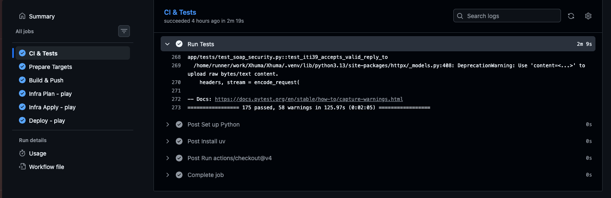
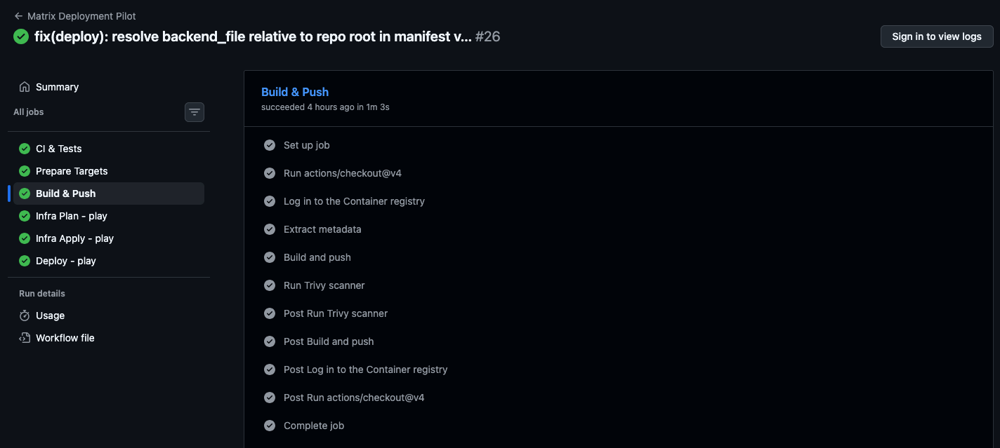
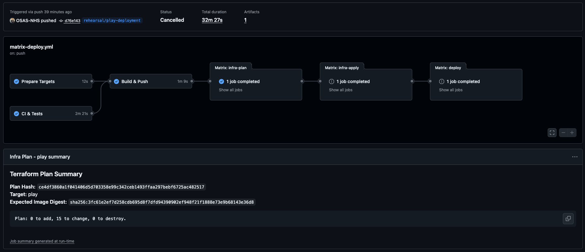
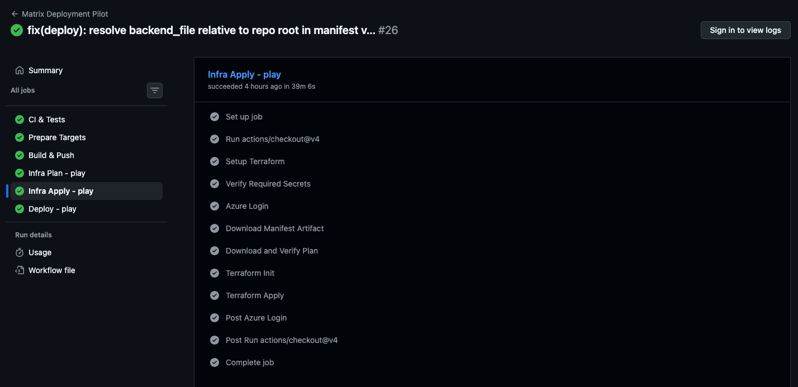
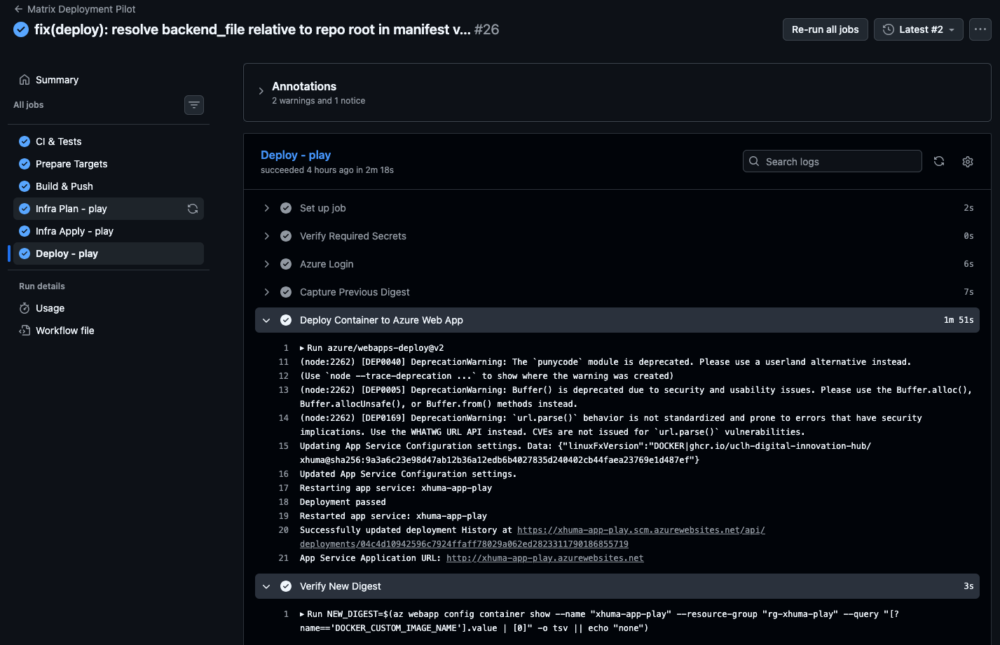
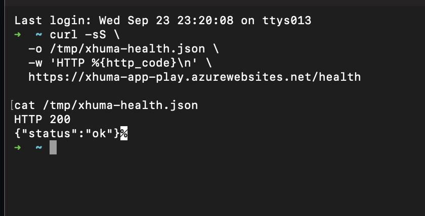

# Xhuma Operator's Manual

**Document Purpose:** This manual provides a comprehensive, end-to-end runbook for deploying, configuring, and maintaining the Xhuma middleware across NHS Trust environments, including the `play` environment rehearsal.

**Security Rule for Operators:**
> [!WARNING]
> **Screenshots and Logs:** Screenshots and command outputs must **never** expose credentials, secret values, access/storage keys, tokens, full Terraform plans, connection strings, or sensitive application configuration.

> **Note:** Screenshots included in this manual are illustrative evidence captured during the September 2026 Play rehearsal. Commands and configuration in this runbook are authoritative; UI screenshots may change as GitHub and Azure evolve.

---

## Table of Contents
1. [Architecture Overview](#1-architecture-overview)
2. [Infrastructure Bootstrapping and State Storage](#2-infrastructure-bootstrapping-and-state-storage)
3. [Azure Service Principal & Permissions](#3-azure-service-principal--permissions)
4. [Setting Up Variables](#4-setting-up-variables)
5. [Key Vault Population](#5-key-vault-population)
6. [Deployment Orchestration](#6-deployment-orchestration)
7. [Verification and Health Checks](#7-verification-and-health-checks)
8. [Shared Infrastructure Adoption (Terraform)](#8-shared-infrastructure-adoption-terraform)
9. [Quick Operator Commands](#9-quick-operator-commands)
10. [Assurance and Evidence Records](#10-assurance-and-evidence-records)

---

## 1. Architecture Overview

Xhuma utilizes a **Target-isolated matrix deployment with centrally managed shared services**. Every target environment (e.g., `play`, `int`, production trusts) receives its own isolated cloud footprint for compute and data to prevent cross-contamination of health data and limit blast radius. 

- **Shared Resources:** A centrally managed Azure Resource Group hosts shared services with separate lifecycle/ownership, such as the Public JSON Web Key Set (JWKS) via Blob Storage and a Shared Key Vault for global secrets (e.g., API keys, DM+D secrets).
- **Target-Local Resources:** Each environment receives a dedicated Azure App Service, VNet, Managed Redis, PostgreSQL, and Local Key Vault.

---

## 2. Infrastructure Bootstrapping and State Storage

Terraform state and reviewed execution plans are stored securely in Azure Blob Storage. Each target has its own storage account within its target resource group.

### 2.1 Reused Bootstrapping Procedure
We reuse the established bootstrap logic across environments. For `play`, we now utilize a target-agnostic script.

1. **Target Configuration**: Verify your target configuration in `infra/targets.json` and backend coordinates in `infra/backends/play.hcl`.
2. **Execution**: The `matrix-deploy.yml` workflow automatically runs the bootstrap script:
   ```bash
   export AZURE_SUBSCRIPTION_ID="<your-subscription>"
   export AZURE_TENANT_ID="<your-tenant>"
   export XHUMA_BACKEND_FILE="infra/backends/play.hcl"
   bash infra/bootstrap/setup-target.sh
   ```
   This creates the state storage account and containers in the target resource group. `tfplans` automatically expires files after 7 days to prevent unbounded plan retention. It is important to note that this step performs writes to Azure Storage (creating the storage account and blob containers) *before* the infrastructure plan is even generated or approved.

*(Note: Entra Blob authentication and OIDC are scheduled as separate, later hardening changes. We currently use interim storage-key authentication and long-lived Service Principal credentials.)*

---

## 3. Azure Service Principal & Permissions

To allow GitHub Actions to deploy infrastructure and code, Xhuma currently relies on a Service Principal with client secrets.

1. **Target Resource Group Permissions**: The SP requires `Contributor` rights over the target Azure Resource Group, and must be able to list storage account keys for the state backend.
2. **Shared Key Vault Access Prerequisite**: The Terraform configuration explicitly writes access policies to the shared key vault (`xhuma-shared-kv-int`) for the newly provisioned App Service identity and Locust Managed Identity. **The Service Principal must have `Key Vault Contributor` (or equivalent `Microsoft.KeyVault/vaults/accessPolicies/write` permissions) on the shared Key Vault.** This is an approved onboarding prerequisite.
3. **Expiry & Rotation**: Ensure the SP secret is rotated before expiry. Update the `AZURE_CLIENT_SECRET` in GitHub Secrets upon rotation.
4. **GitHub Secrets Configuration**:
   - `AZURE_CLIENT_ID`
   - `AZURE_CLIENT_SECRET`
   - `AZURE_TENANT_ID`
   - `AZURE_SUBSCRIPTION_ID`
   - `SHARED_SUBSCRIPTION_ID`

---

## 4. Setting Up Variables

### 4.1 Matrix Deployment Workflow

The deployment relies on specific GitHub environments to orchestrate the provisioning and rollout phases securely. 


*Figure 1 — Pre-plan approval gate — Run #32 paused before `Infra Plan - play` because the `play-plan` GitHub Environment required reviewer approval.*

> **Control note:** During the September 2026 Play rehearsal, `play-plan` required reviewer approval. The workflow source currently describes the plan environment as having no manual approvers. Confirm the intended control model before INT migration.

**Environment Configuration:**

| GitHub environment    | Required secrets                                                                                                          |
| --------------------- | ------------------------------------------------------------------------------------------------------------------------- |
| `play-plan`           | Azure credential set; `CR_PAT`; `REGISTRY_ID`; `POSTGRES_PASSWORD`; `SHARED_KEY_VAULT_NAME`; `SHARED_RESOURCE_GROUP_NAME`; `SHARED_SUBSCRIPTION_ID` |
| `rg-xhuma-play-infra` | Azure credential set                                                                                                      |
| `rg-xhuma-play`       | Azure credential set                                                                                                      |

*Note: The Azure credential set consists of `AZURE_CLIENT_ID`, `AZURE_CLIENT_SECRET`, `AZURE_TENANT_ID`, and `AZURE_SUBSCRIPTION_ID`. Do not duplicate Terraform input secrets in the apply/deploy environments, as apply consumes the saved plan.*

**Shared Resources Configuration:**
The `SHARED_SUBSCRIPTION_ID` is `c24b0c3e-9e09-4c7c-8687-75e8b654bc8e`. This cross-subscription variable must be explicitly provided to the environments running Terraform Plan (e.g., `play-plan` for matrix deployments) and the legacy `infra.yml` workflow, which provisions INT and production infrastructure.

**Actual Deployment Sequence:**

1. **Configure GitHub Environments & Secrets:** Ensure the environments (`play-plan`, `rg-xhuma-play-infra`, `rg-xhuma-play`) exist and their secrets are securely stored. Environment names alone do not configure protection; you must set manual approvers on `rg-xhuma-play-infra` and `rg-xhuma-play`.
2. **Automatic Bootstrap and Plan:** The workflow automatically runs the bootstrap script to create state storage (if missing), then executes `terraform plan`. The generated plan is uploaded securely and its hash is presented for review.
3. **Review and Approved Apply:** Operators review the plan output. Once approved, the apply job verifies the plan hash and provisions the infrastructure.
4. **Local-Vault Onboarding:** With the infrastructure provisioned, the operator manually injects required operational secrets (e.g., `epic-ca-cert`) into the newly created target Key Vault.
5. **Approved Application Deployment:** Once the vault is ready, the deployment job replaces the inert bootstrap image with the actual application container digest.
6. **Verification and Manual Rollback:** The new image digest is verified. If issues occur, operators manually roll back by deploying a previous known-good digest, ensuring no concurrent deployment or database incompatibility.

---

## 5. Key Vault Population

Before functional verification can succeed, the environment's local Key Vault must be populated by an operator.

1. `epic-ca-cert`: The target-specific Epic Root CA certificate (Base64 PEM) used for mutual TLS (mTLS).
2. **Populating the Vault**: Use the Azure Portal or CLI to add the secret to the newly provisioned Local Key Vault (e.g., `kv-xhuma-play-...`).
   *Note: Ensure multi-line PEM files are formatted correctly (newlines replaced if pasting into the Azure Portal).*

---

## 6. Deployment Orchestration

Deployment is handled by GitHub Actions (`.github/workflows/matrix-deploy.yml`), which enforces strict boundaries:
- `matrix-deploy.yml` currently orchestrates only the `play` environment from the `rehearsal/play-deployment` branch.
- Legacy pipelines (`cd.yml` and `infra.yml`) still own the deployment to `int` and `prd` from the `int` and `main` branches.

### 6.1 Continuous Integration and Build Controls

Before any deployment plan is generated, the pipeline enforces strict quality and security gates:


*Figure 2 — CI & Tests stage confirming all tests pass before proceeding.*


*Figure 3 — Build & Push stage showing the immutable image build and Trivy vulnerability scan.*

### 6.2 First Deployment & Protected Plans
1. **Trigger**: Push code to the mapped branch (e.g., `rehearsal/play-deployment`).
2. **Plan Generation**: The workflow generates a Terraform plan and securely uploads it to the `tfplans` container in Azure Storage. Only a non-secret plan hash and summary are available in GitHub. Plan generation will fail if a plan already exists for that run.
3. **Review & Approval**: An authorized operator must review the plan summary in GitHub (and the full plan in Azure Storage if necessary) using the strict review hierarchy below. Then, explicitly approve the infrastructure environment (`rg-xhuma-play-infra`).

### 6.3 Terraform Plan Review Before Approval

When reviewing an immutable saved plan for approval, operators must follow this COMPLETE worked procedure to prevent accidental disruption and avoid exposing sensitive state data.

**Explicit STOP Conditions:**
Do NOT proceed if you observe any of the following:
- Plan SHA mismatch
- Wrong target/subscription/commit
- Unexplained destroy/replacement
- Unexplained resource or attribute drift
- Unexpected shared/production resources in the plan
- Unresolved Key Vault references
- Failed health/digest verification

**Step-by-step Review Procedure:**

1. **Select the target Azure subscription:**
   ```bash
   az account set --subscription "<target-subscription-id>"
   ```
2. **Securely obtain the plan storage credentials:**
   ```bash
   RG_NAME="<backend-resource-group>"
   SA_NAME="<backend-storage-account>"
   ACCOUNT_KEY=$(az storage account keys list --resource-group "$RG_NAME" --account-name "$SA_NAME" --query '[0].value' -o tsv)
   ```
3. **Download the exact immutable `.tfplan`:**
   ```bash
   PLAN_FILE="<plan-filename>"
   az storage blob download --account-name "$SA_NAME" --account-key "$ACCOUNT_KEY" --container-name tfplans --name "$PLAN_FILE" --file "/tmp/$PLAN_FILE"
   ```
4. **SHA256 verification against the workflow manifest/job summary:**
   ```bash
   sha256sum "/tmp/$PLAN_FILE"
   # Compare the output hash with the manifest or GitHub Actions job summary. STOP if SHA differs.
   ```
   *(Note: The plan hash verification is automatically performed by the CI pipeline, but operators should verify manually if performing manual applies).*

5. **Determine and install the exact Terraform version used by the workflow:**
   Check the workflow file for the pinned version (e.g., `1.5.7`). If Cloud Shell differs, temporarily install it.
6. **Checkout the exact source commit SHA:**
   ```bash
   git checkout <commit-sha>
   ```
7. **Initialize Terraform locally without connecting to remote state:**
   ```bash
   terraform init -backend=false -input=false
   ```
8. **Review headline counts and changes against the immutable plan:**
   Run `terraform show -json` against the immutable plan to review the changes. Check the high-level summary (`X add, Y change, Z destroy`).
   
   **Extract changed resource addresses/actions:**
   ```bash
   terraform show -json "/tmp/$PLAN_FILE" | jq '.resource_changes[] | {address, actions: .change.actions}'
   ```
   *(Note: This safe summary is also printed in the GitHub Actions step summary).*

9. **Extract changed attribute PATHS only:** 
   If a resource change is unexplained, inspect which specific attributes are changing, without looking at the values using the exact tested jq command:
   ```bash
   terraform show -json "/tmp/$PLAN_FILE" | jq -r '
     .resource_changes[]
     | select(.change.actions != ["no-op"])
     | .address as $addr
     | (.change.before // {}) as $before
     | (.change.after // {}) as $after
     | ([($before | paths(scalars)), ($after | paths(scalars))] | unique[]) as $p
     | select(($before | getpath($p)) != ($after | getpath($p)))
     | "\($addr)\t\($p | map(tostring) | join("."))"
   '
   ```
10. **Selectively inspect non-sensitive before/after values:** If still unexplained, only inspect attributes known to be non-sensitive. Never dump the complete JSON Terraform plan into GitHub logs or documentation.

> **Example (Play Rehearsal, Sept 2026):**
> A superficially safe plan showed: `0 to add, 15 to change, 0 to destroy`. 
>
> 
> *Figure 4 — Play rehearsal plan showing 0 add / 15 change / 0 destroy. Further inspection revealed unexplained drift and Apply was withheld.*
> 
> Resource-level inspection looked non-destructive (in-place updates). However, attribute-path inspection revealed that Terraform intended to remove externally-managed organisational tags, Azure-managed integration metadata (Application Insights hidden links), and an existing DB subnet `Microsoft.Storage` service endpoint. The Apply was rightfully withheld, and the Terraform ownership configuration was corrected via `ignore_changes` rather than blindly applying the drift.

### 6.4 Plan Retries & Image Deployment


*Figure 5 — Infrastructure Apply approval gate — after Terraform Plan completes, Run #32 pauses at `rg-xhuma-play-infra`. The immutable plan hash, target and expected container digest remain visible before the reviewed plan can be applied.*


*Figure 6 — Successful infrastructure Apply job, completing only after the strict plan review and GitHub Environment manual approval.*

1. **Plan Retries & Expiry**: If the apply step fails, it can be retried and will re-download the exact same plan blob securely. Plans expire automatically after 7 days in Blob Storage. If a plan is no longer valid, a completely new workflow run is required to generate and approve a new plan.
2. **Image Deployment**: After infrastructure applies the inert bootstrap image, the pipeline deploys the exact scanned Docker image digest. This step requires a separate environment approval (`rg-xhuma-play`).


*Figure 7 — The application image is deployed deterministically using the exact immutable SHA256 digest validated during the build stage.*

### 6.5 Digest Rollback & Recovery
Deployment is deterministic. We record the previous digest before deploying and the new digest after.

1. **Recovery Ownership**: If a deployment introduces regressions, authorized operators can perform a rollback.
2. **Rollback Procedure**: 
   - Identify the previous known-good digest from the deployment step summary.
   - Manually trigger a recovery deployment via Azure CLI or a dedicated rollback workflow using that specific digest:
     ```bash
     az webapp config container set --name <app_service> --resource-group <rg> --docker-custom-image-name ghcr.io/...@sha256:...
     ```
   - Ensure older application code is compatible with the current Alembic database schema migrations.

---

## 7. Verification and Health Checks

### 7.1 Safe Verification Boundaries
- **Liveness Probe**: The `/health` endpoint is unauthenticated and returns a coarse HTTP 200 process-liveness signal. It does not leak secrets, tokens, or perform downstream NHS requests.
- **Protected Readiness**: Startup configuration, database, and relay status are checked via Azure App Service health monitoring and Azure-side operational probes, rather than exposing an unauthenticated diagnostic endpoint.
- **Manual Clinical Check**: Because the GitHub Actions runner does not possess the required mTLS certificates, a manual synthetic test must be run from a trusted clinical workstation to verify SOAP mTLS and audit capabilities after deployment.

### 7.2 Operator Checklist for New Environments

**Implemented Readiness Checks (Automated):**
- [ ] Application liveness probe (HTTP 200).
- [ ] Status-only Key Vault resolution check (if supported by access model).
- [ ] Digest verification of the deployed container.

**Manual Prerequisites (To be done by Operator):**
- [ ] Target configuration defined in `infra/targets.json`.
- [ ] Scoped Azure SP access configured and credentials placed in GitHub.
- [ ] GitHub Environment approvals configured for infra apply and container deployment.
- [ ] Local Key Vault populated with `epic-ca-cert`.
- [ ] App Service integration subnet ID added to `infra/shared/env/shared.tfvars` (Terraform-managed shared Key Vault network ACL onboarding).

**Follow-ups / Manual Exercises:**
- [ ] [TODO: automate] Trust-local authentication.
- [ ] [TODO: automate] Audit retention/access policies.
- [ ] [TODO: automate] Restore evidence.
- [ ] [TODO: automate] Key rotation.
- [ ] Run synthetic manual clinical check (SOAP/mTLS) from a trusted workstation.
- [ ] Rollback exercise performed and documented.

### 7.3 Key Vault Reference Verification

A mandatory verification step must be performed post-Terraform and pre-functional-testing to ensure the App Service can resolve its `@Microsoft.KeyVault(...)` configuration references. Note that Terraform automatically provisions the App Service managed-identity access policy on the shared Key Vault.

When the shared Key Vault is configured with `DefaultAction = Deny`, the target App Service integration subnet must explicitly be permitted by the vault's network ACL.

**Verification Sequence:**
1. Confirm the App Service system-assigned managed identity exists.
2. Confirm the required secret permissions/access policy exist on the shared vault.
3. Confirm the target App Service subnet is permitted by the shared vault's network ACL.
4. Confirm the App Service Key Vault reference status is `Resolved`.
5. **Do not proceed** to functional testing if the reference status is `AccessToKeyVaultDenied`, `SecretNotFound`, or any other unresolved state.

*(Note: Verification can be performed via the Azure Portal or using the `az webapp config appsettings` command to verify values are appropriately retrieved rather than remaining as raw references).*

### 7.4 Post-Deployment Health Verification

Run the following reproducible command to verify application liveness:

```bash
curl -sS \
  -o /tmp/xhuma-health.json \
  -w 'HTTP %{http_code}\n' \
  https://<app_service>.azurewebsites.net/health

cat /tmp/xhuma-health.json
```


*Figure 8 — Post-deployment liveness verification: the Play App Service returned HTTP 200 with `{"status":"ok"}`. This is a coarse liveness signal, and does not replace deep clinical/readiness testing.*

---

## 8. Shared Infrastructure Adoption (Terraform)

When managing shared infrastructure components (such as the shared Key Vault `xhuma-shared-kv-int` network ACLs) in Terraform:
- Ensure the resource includes a `lifecycle { prevent_destroy = true }` block.
- **Note:** `prevent_destroy` does not guarantee Terraform will never *propose* replacement. Instead, any proposed destruction or replacement of the imported shared Key Vault will be blocked by `prevent_destroy` during the apply phase.
- Therefore, the initial reconciliation plan must be clean and contain no proposed destruction or replacement of the vault before any apply is attempted.

---

## 9. Quick Operator Commands

Use these safe generic commands to inspect environments. Replace placeholders (e.g. `<target-subscription-id>`, `<app_service>`, `<rg>`) with the actual environment values.

- **Current Azure subscription:**
  ```bash
  az account show --query name -o tsv
  ```
- **App Service managed identity:**
  ```bash
  az webapp identity show --name <app_service> --resource-group <rg> --query principalId -o tsv
  ```
- **SHA256 verification:**
  ```bash
  sha256sum <target>-plan.tfplan
  ```
- **Changed Terraform resources/actions:**
  ```bash
  terraform show -json <target>-plan.tfplan | jq '.resource_changes[] | {address, actions: .change.actions}'
  ```
- **Changed Terraform attribute paths:**
  ```bash
  terraform show -json <target>-plan.tfplan | jq -r '
    .resource_changes[]
    | select(.change.actions != ["no-op"])
    | .address as $addr
    | (.change.before // {}) as $before
    | (.change.after // {}) as $after
    | ([($before | paths(scalars)), ($after | paths(scalars))] | unique[]) as $p
    | select(($before | getpath($p)) != ($after | getpath($p)))
    | "\($addr)\t\($p | map(tostring) | join("."))"
  '
  ```
- **App Service health:**
  ```bash
  curl -s https://<app_service>.azurewebsites.net/health
  ```
- **Key Vault reference verification (list settings):**
  ```bash
  az webapp config appsettings list --name <app_service> --resource-group <rg> --query "[?contains(value, '@Microsoft.KeyVault')].{name:name, value:value}" -o table
  ```
- **Currently deployed container digest:**
  ```bash
  az webapp config show --name <app_service> --resource-group <rg> --query 'linuxFxVersion' -o tsv
  ```
- **Relevant workflow/run identifiers:**
  ```bash
  gh run view <run-id>
  ```

---

## 10. Assurance and Evidence Records

Specific deployment rehearsals and assurance events are captured as immutable evidence records. These records are retained separately from this living operational runbook to preserve point-in-time factual observations.

- [Play Matrix Deployment Rehearsal (23 September 2026)](./assurance/evidence/2026-09-23-play-matrix-deployment-rehearsal.md)


---

## Appendix — Xhuma Deployment for Tired Humans

This quick-start guide is intentionally simple. For the authoritative, detailed runbook, see the sections above.

1. Push code.
2. Wait for CI & Tests, Prepare Targets and Build & Push to go green.
3. If `play-plan` asks for approval, click View.
4. Check/select the correct environment and approve only if the target/run is expected.


*Figure 9 — Plan-stage approval dialog — the operator explicitly selects `play-plan` and approves the protected environment before the workflow can continue.*

5. Wait for Terraform Plan.
6. Read add/change/destroy counts and changed-resource summary.
7. If you do not understand a change, STOP.
8. Approve `rg-xhuma-play-infra` only after the immutable plan is understood.


*Figure 10 — Infrastructure Apply approval gate — after Terraform Plan completes, Run #32 pauses at `rg-xhuma-play-infra`. The immutable plan hash, target and expected container digest remain visible before the reviewed plan can be applied.*

9. Wait for Apply.
10. Approve application deployment only after infrastructure is healthy.
11. Verify immutable digest and `/health` HTTP 200.
12. Remember: HTTP 200 proves liveness, not full clinical functionality.
13. If confused, stop rather than improvise.
