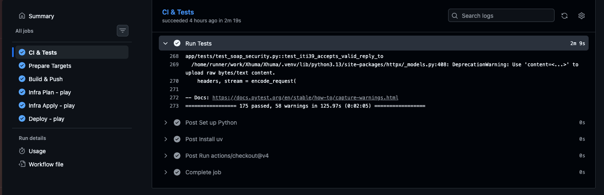
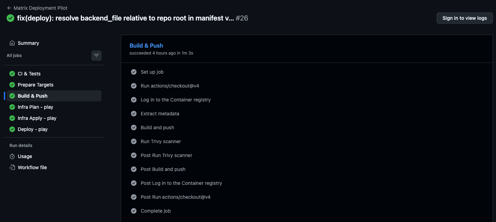
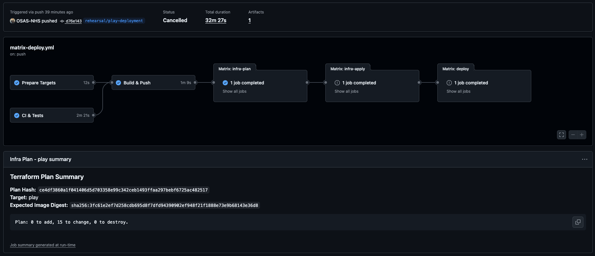
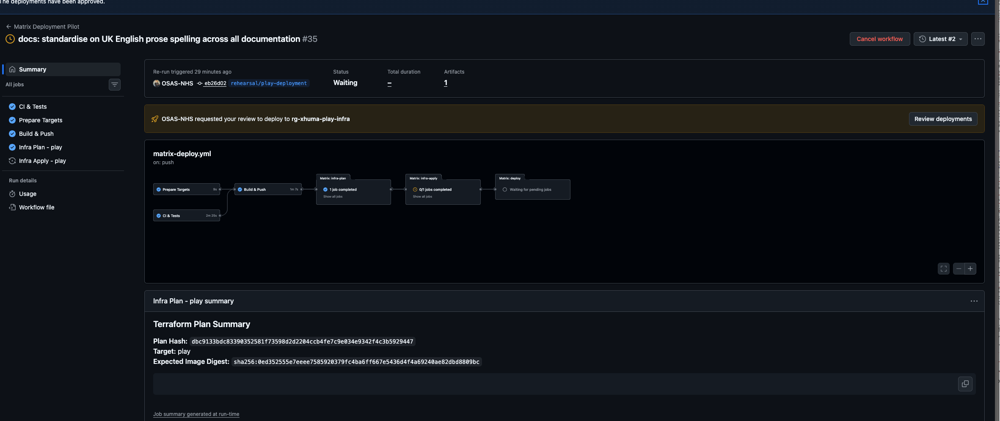
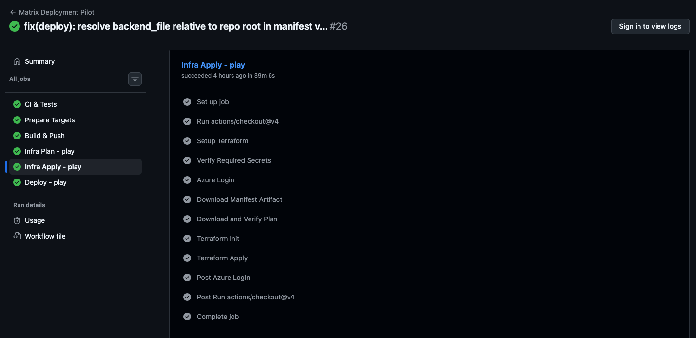
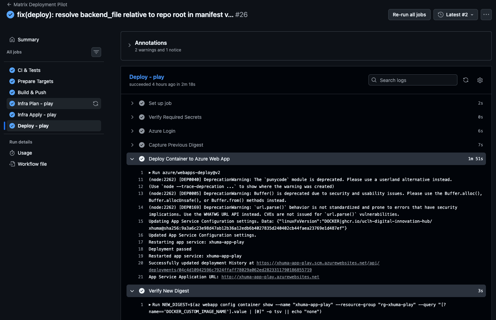
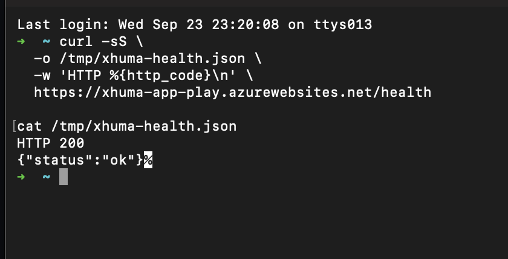

# Xhuma Operator's Manual

**Document Purpose:** This manual provides a comprehensive, end-to-end runbook for deploying, configuring, and maintaining the Xhuma middleware across NHS Trust environments, including the `play` environment rehearsal.

**Security Rule for Operators:**
> [!WARNING]
> **Screenshots and Logs:** Operational evidence must not contain credentials, tokens, patient data, certificate material, secret-valued configuration or protected infrastructure identifiers.

> **Note:** Screenshots included in this manual are illustrative evidence captured during the September 2026 Play rehearsal. Commands and configuration in this runbook are authoritative; UI screenshots may change as GitHub and Azure evolve.

> **Tired? in a hurry?** See the [Xhuma Deployment for Tired Humans](./deployment_for_tired_humans.md) quick-start guide.

---

## Table of Contents
1. [Architecture Overview](#1-architecture-overview)
2. [Infrastructure Bootstrapping and State Storage](#2-infrastructure-bootstrapping-and-state-storage)
3. [Azure Service Principal & Permissions](#3-azure-service-principal--permissions)
4. [Setting Up Variables](#4-setting-up-variables)
5. [Key Vault Population](#5-key-vault-population)
6. [Deployment Orchestration](#6-deployment-orchestration)
7. [Verification and Health Checks](#7-verification-and-health-checks)
8. [Shared Infrastructure Adoption (Terraform)](#8-shared-infrastructure-adoption-terraform)
9. [Quick Operator Commands](#9-quick-operator-commands)
10. [Assurance and Evidence Records](#10-assurance-and-evidence-records)

---

## 1. Architecture Overview

Xhuma utilises a **Target-isolated matrix deployment with centrally managed shared services**. Every target environment (e.g., `play`, `int`, production trusts) receives its own isolated cloud footprint for compute and data to prevent cross-contamination of health data and limit blast radius. 

- **Shared Resources:** A centrally managed Azure Resource Group (e.g., `rg-xhuma-<shared-scope>`) hosts shared services with separate lifecycle/ownership, such as the Public JSON Web Key Set (JWKS) via Blob Storage and a Shared Key Vault (e.g., `xhuma-shared-kv-<environment>`) for global secrets (e.g., API keys, DM+D secrets). Environment-specific shared resources must remain logically separate, with distinct Key Vaults, Terraform state, and backend keys. A separate resource group per environment may be used as a hardening option, but it is not currently a mandatory Xhuma design principle.
- **Target-Local Resources:** Each environment receives a dedicated Azure App Service, VNet, Managed Redis, PostgreSQL, and Local Key Vault (e.g., `xhuma-<site>-kv`). Target workloads are isolated per environment/site.

---

## 2. Infrastructure Bootstrapping and State Storage

Terraform state and reviewed execution plans are stored securely in Azure Blob Storage. Each target has its own storage account within its target resource group.

### 2.1 Reused Bootstrapping Procedure
We reuse the established bootstrap logic across environments. For `play`, we now utilise a target-agnostic script.

1. **Target Configuration**: Verify your target configuration in `infra/targets.json` and backend coordinates in `infra/backends/play.hcl`.
2. **Execution**: The `matrix-deploy.yml` workflow automatically runs the bootstrap script:
   ```bash
   export AZURE_SUBSCRIPTION_ID="<your-subscription>"
   export AZURE_TENANT_ID="<your-tenant>"
   export XHUMA_BACKEND_FILE="infra/backends/play.hcl"
   bash infra/bootstrap/setup-target.sh
   ```
   This creates the state storage account and containers in the target resource group. `tfplans` automatically expires files after 7 days to prevent unbounded plan retention. It is important to note that this step performs writes to Azure Storage (creating the storage account and blob containers) *before* the infrastructure plan is even generated or approved.

*(Note: Entra Blob authentication and OIDC are scheduled as separate, later hardening changes. We currently use interim storage-key authentication and long-lived Service Principal credentials.)*

---

## 3. Azure Service Principal & Permissions

To allow GitHub Actions to deploy infrastructure and code, Xhuma currently relies on a Service Principal with client secrets.

1. **Target Resource Group Permissions**: Target resource group creation and initial RBAC assignments are privileged administrative bootstrap operations performed outside the normal deployment identity. The Service Principal requires least privilege rights (e.g. Contributor) strictly scoped to the pre-existing target Azure Resource Group. CI will fail closed if the expected target Resource Group does not exist, rather than requiring subscription-wide Contributor permissions.
2. **Shared Key Vault Access Prerequisite**: The Terraform configuration securely manages access policies on the shared Key Vault. The Service Principal requires sufficient rights to manage these policies.
3. **Expiry & Rotation**: Ensure the deployment credential is rotated before expiry. Update the relevant GitHub Secret upon rotation.

---

## 4. Setting Up Variables

### 4.1 Matrix Deployment Workflow

The deployment relies on specific GitHub environments to orchestrate the provisioning and rollout phases securely. 


*Figure 1 — Pre-plan approval gate — Run #32 paused before `Infra Plan - play` because the `play-plan` GitHub Environment required reviewer approval.*

**Environment Configuration:**

Deployments use protected GitHub Environments and dedicated Azure deployment identities. Target-specific credentials, role assignments, environment configuration and approval topology are maintained in the restricted operational record and are intentionally not reproduced in this public runbook.

**Target Inventory Model:**
Future Trust/site deployments will be data-driven from the validated `infra/targets.json` inventory rather than requiring duplicated CI/CD workflows. Staged fleet deployment is controlled via the `hold` and `rollout_ring` attributes in this inventory. Greenfield targets (e.g., new deployments) generally have `require_existing_state=false`, whereas migrated or brownfield environments must use `require_existing_state=true` to enforce existing-state preflight and state-anchor validation.

**Shared Resources Configuration:**
The shared subscription ID (e.g. `<shared-subscription-id>`) and related shared variables (e.g. `SHARED_RESOURCE_GROUP_NAME`) must be explicitly provided to the environments running Terraform Plan and Apply.

**Actual Production Deployment Sequence:**

1. **Continuous Integration & Build**: CI/tests execute, followed by immutable image build and vulnerability scan.
2. **Target Selection**: Targets are parsed from `infra/targets.json`.
3. **Terraform Plan**: Generates an infrastructure plan.
4. **Immutable Plan Storage**: The exact plan and a SHA256 manifest are securely stored.
5. **Human Infrastructure Approval**: Operators review and approve the exact plan in GitHub.
6. **Apply Infrastructure**: Applies the reviewed exact plan.
7. **Shared Infrastructure Reconciliation**: The target integrates with shared services (e.g., shared Key Vault network ACLs).
8. **Application Deployment Approval**: A separate approval gate is used before application deployment.
9. **Digest Verification & Health Check**: The exact image digest is verified and an unauthenticated `/health` check confirms coarse liveness.
10. **Subsequent Functional/Clinical Acceptance**: (See section 7.5). Note that infrastructure deployment being successful does not imply clinical commissioning; PRD infrastructure is currently in progress and not fully live.

---

## 5. Key Vault Population

Infrastructure and application liveness can be established before the target-local Epic CA is populated. However, `epic-ca-cert` is required before Epic/SOAP/mTLS functional acceptance.

1. `epic-ca-cert`: The target-specific Epic verification CA bundle required by current application semantics (Base64 PEM) used for mutual TLS (mTLS). It may contain the direct issuing intermediate(s).
2. **Populating the Vault**: Use the Azure Portal or CLI to add the secret to the newly provisioned Local Key Vault (e.g., `<app_service_name>-kv`).
   *Note: Ensure multi-line PEM files are formatted correctly (newlines replaced if pasting into the Azure Portal).*

---

## 6. Deployment Orchestration

The matrix workflow (`.github/workflows/matrix-deploy.yml`) is the authoritative deployment path for all environments (`play`, `int`, and `prd`). The legacy deployment pipelines have been retired.

### 6.0 Release Promotion Model

The deployment lifecycle explicitly separates code integration from release promotion:
- **Development**: All standard development occurs on the `dev` branch.
- **Release Candidate**: To prepare a release, a `release/x.y` candidate branch is created from `dev`.
- **INT Promotion & Validation**: The candidate is promoted/pushed to the `int` branch, deploying the candidate to the `INT` environment where it is validated and assured.
- **PRD Promotion**: Upon successful validation, the exact same `release/x.y` candidate is merged into `main` (for PRD deployment).
- **Reconciliation**: After the release is successfully deployed, `main` is back-merged into `dev` to reconcile any hotfixes or deployment-specific configuration changes.

Do not describe `int` -> `main` as the normal release mechanism; `int` is a deployment target environment, whereas `main` tracks the production release.

### 6.1 Continuous Integration and Build Controls

Before any deployment plan is generated, the pipeline enforces strict quality and security gates:


*Figure 2 — CI & Tests stage confirming all tests pass before proceeding.*


*Figure 3 — Build & Push stage showing the immutable image build and Trivy vulnerability scan.*

### 6.2 First Deployment & Protected Plans
1. **Trigger**: Push code to the mapped branch (e.g., `rehearsal/play-deployment`).
2. **Plan Generation**: The workflow generates a Terraform plan and securely uploads it to the `tfplans` container in Azure Storage. Only a non-secret plan hash and summary are available in GitHub. Plan generation will fail if a plan already exists for that run.
3. **Review & Approval**: An authorized operator must review the plan summary in GitHub (and the full plan in Azure Storage if necessary) using the strict review hierarchy below. Then, explicitly approve the infrastructure environment (e.g., `<rg-target-infra>`).

### 6.3 Terraform Plan Review Before Approval

When reviewing an immutable saved plan for approval, operators must follow this COMPLETE worked procedure to prevent accidental disruption and avoid exposing sensitive state data.

**Explicit STOP Conditions:**
Do NOT proceed if you observe any of the following:
- Plan SHA mismatch
- Wrong target/subscription/commit
- Unexplained destroy/replacement
- Unexplained resource or attribute drift
- Unexpected shared/production resources in the plan
- Unresolved Key Vault references
- Failed health/digest verification

**Step-by-step Review Procedure:**

1. **Select the target Azure subscription:**
   ```bash
   az account set --subscription "<target-subscription-id>"
   ```
2. **Securely obtain the plan storage credentials:**
   ```bash
   RG_NAME="<backend-resource-group>"
   SA_NAME="<backend-storage-account>"
   # Obtain credentials securely via Azure AD or approved operational method
   ```
3. **Download the exact immutable `.tfplan`:**
   ```bash
   PLAN_FILE="<plan-filename>"
   az storage blob download --auth-mode login --account-name "$SA_NAME" --container-name tfplans --name "$PLAN_FILE" --file "/tmp/$PLAN_FILE"
   ```
4. **SHA256 verification against the workflow manifest/job summary:**
   ```bash
   sha256sum "/tmp/$PLAN_FILE"
   # Compare the output hash with the manifest or GitHub Actions job summary. STOP if SHA differs.
   ```
   *(Note: The plan hash verification is automatically performed by the CI pipeline, but operators should verify manually if performing manual applies).*

5. **Determine and install the exact Terraform version used by the workflow:**
   Check the workflow file for the pinned version (e.g., `1.5.7`). If Cloud Shell differs, temporarily install it.
6. **Checkout the exact source commit SHA:**
   ```bash
   git checkout <commit-sha>
   ```
7. **Initialise Terraform locally without connecting to remote state:**
   ```bash
   terraform init -backend=false -input=false
   ```
8. **Review headline counts and changes against the immutable plan:**
   Run `terraform show -json` against the immutable plan to review the changes. Check the high-level summary (`X add, Y change, Z destroy`).
   
   **Extract changed resource addresses/actions:**
   ```bash
   terraform show -json "/tmp/$PLAN_FILE" | jq '.resource_changes[] | {address, actions: .change.actions}'
   ```
   *(Note: This safe summary is also printed in the GitHub Actions step summary).*

9. **Extract changed attribute PATHS only:** 
   If a resource change is unexplained, inspect which specific attributes are changing, without looking at the values using the exact tested jq command:
   ```bash
   terraform show -json "/tmp/$PLAN_FILE" | jq -r '
     .resource_changes[]
     | select(.change.actions != ["no-op"])
     | .address as $addr
     | (.change.before // {}) as $before
     | (.change.after // {}) as $after
     | ([($before | paths(scalars)), ($after | paths(scalars))] | unique[]) as $p
     | select(($before | getpath($p)) != ($after | getpath($p)))
     | "\($addr)\t\($p | map(tostring) | join("."))"
   '
   ```
10. **Selectively inspect non-sensitive before/after values:** If still unexplained, only inspect attributes known to be non-sensitive. Never dump the complete JSON Terraform plan into GitHub logs or documentation.

> **Example (Play Rehearsal, Sept 2026):**
> A superficially safe plan showed: `0 to add, 15 to change, 0 to destroy`. 
>
> 
> *Figure 4 — Play rehearsal plan showing 0 add / 15 change / 0 destroy. Further inspection revealed unexplained drift and Apply was withheld.*
> 
> Resource-level inspection looked non-destructive (in-place updates). However, attribute-path inspection revealed that Terraform intended to remove externally-managed organisational tags, Azure-managed integration metadata (Application Insights hidden links), and an existing DB subnet `Microsoft.Storage` service endpoint. The Apply was rightfully withheld, and the Terraform ownership configuration was corrected via `ignore_changes` rather than blindly applying the drift.


*Figure 5 — Play convergence check — Run #35. Following the Terraform ownership and drift corrections, the Play environment produced a clean Terraform plan with no infrastructure changes. The reviewed saved plan was then applied successfully through the protected infrastructure gate without mutating Azure resources.*

### 6.4 Plan Retries & Image Deployment


*Figure 6 — Infrastructure Apply approval gate — after Terraform Plan completes, Run #32 pauses at `<target>-infra`. The immutable plan hash, target and expected container digest remain visible before the reviewed plan can be applied.*


*Figure 7 — Successful infrastructure Apply job, completing only after the strict plan review and GitHub Environment manual approval.*

1. **Plan Retries & Expiry**: If the apply step fails, it can be retried and will re-download the exact same plan blob securely. Plans expire automatically after 7 days in Blob Storage. If a plan is no longer valid, a completely new workflow run is required to generate and approve a new plan.
2. **Image Deployment**: After infrastructure applies the inert bootstrap image, the pipeline deploys the exact scanned Docker image digest. This step requires a separate environment approval.


*Figure 8 — The application image is deployed deterministically using the exact immutable SHA256 digest validated during the build stage.*

### 6.5 Digest Rollback & Recovery
Deployment is deterministic. We record the previous digest before deploying and the new digest after.

1. **Recovery Ownership**: If a deployment introduces regressions, authorized operators can perform a rollback.
2. **Rollback Procedure**: 
   - Identify the previous known-good digest from the deployment step summary.
   - Manually trigger a recovery deployment via Azure CLI or a dedicated rollback workflow using that specific digest:
     ```bash
     az webapp config container set --name <app_service> --resource-group <rg> --docker-custom-image-name ghcr.io/...@sha256:...
     ```
   - Ensure older application code is compatible with the current Alembic database schema migrations. Immutable image rollback is available, but image rollback is only safe when the previous application release is compatible with the schema already migrated by the newer release. The formal migration compatibility / downgrade policy remains a handover-readiness item. Operators must not assume that reverting the container digest also reverts PostgreSQL.

---

## 7. Verification and Health Checks

### 7.1 Safe Verification Boundaries
- **Liveness Probe**: The `/health` endpoint is unauthenticated and returns a coarse HTTP 200 process-liveness signal. It does not leak secrets, tokens, or perform downstream NHS requests.
- **Protected Readiness**:
  - **Implemented liveness**: the pipeline calls `/health` after deployment.
  - **Implemented observability foundations**: Application Insights, Log Analytics and PostgreSQL diagnostics.
  - **Application safety**: startup configuration failures fail closed.
  - **Operational monitoring**: Xhuma uses Azure Monitor/Application Insights and Log Analytics for production telemetry. Alert rules also exist in the live Azure environment. The complete alert/routing configuration is not yet codified in the current Terraform deployment model; IaC reconciliation and routing standardisation are a planned operational-hardening activity.
- **Manual Clinical Check**: Because the GitHub Actions runner does not possess the required mTLS certificates, a manual synthetic test must be run from a trusted clinical workstation to verify SOAP mTLS and audit capabilities after deployment.

### 7.2 Operator Checklist for New Environments

**Implemented Readiness Checks (Automated):**
- [ ] Application liveness probe (HTTP 200).
- [ ] Status-only Key Vault resolution check (if supported by access model).
- [ ] Digest verification of the deployed container.

**Manual Prerequisites (To be done by Operator):**
- [ ] Target configuration defined in `infra/targets.json`.
- [ ] Scoped Azure SP access configured and credentials placed in GitHub.
- [ ] GitHub Environment approvals configured for infra apply and container deployment.
- [ ] Local Key Vault populated with `epic-ca-cert`.
- [ ] App Service integration subnet ID added to the shared configuration. *(Note: The shared Terraform root is fully operational. The matrix workflow automatically computes an ephemeral configuration to add the target App Service subnet to the shared Key Vault network ACL while preserving existing rules. A strict guard validates the plan to fail-closed if unexpected changes are proposed before applying.)*

**Follow-ups / Manual Exercises:**
- [ ] [TODO: automate] Trust-local authentication.
- [ ] [TODO: automate] Audit retention/access policies.
- [ ] PostgreSQL restore rehearsal and evidence (record recovery time/result and application recovery verification).
- [ ] Service-principal credential rotation rehearsal.
- [ ] Target Epic certificate rotation rehearsal (post-rotation deployment/mTLS verification).
- [ ] Run synthetic manual clinical check (SOAP/mTLS) from a trusted workstation.
- [ ] Rollback exercise performed and documented.

### 7.3 Custom Domain / DNS / TLS Onboarding

Assigning the externally agreed environment FQDN (e.g., `<environment-hostname>`) to the Azure App Service is a critical post-provisioning step. 

> **Current IaC Limitation:** Custom-domain DNS, App Service hostname binding, and managed-certificate onboarding are currently operator-managed post-provisioning steps. The current Terraform root does not manage the custom hostname binding or certificate. Therefore, a destructive App Service recreation can require the custom hostname/TLS binding to be manually re-established. Future IaC adoption is planned as an operational hardening item.

**Azure Portal Procedure:**
1. Navigate to your target App Service.
2. Select **Custom domains** > **Add custom domain**.
3. For the domain (e.g. `xhuma.co.uk`), use:
   - **Domain provider:** All other domain services
   - **TLS/SSL certificate:** App Service Managed Certificate
   - **TLS/SSL type:** SNI SSL
4. For a subdomain, document the normal DNS pattern exactly as instructed by Azure:
   - **CNAME:** `<environment hostname>` -> `<app-service-name>.azurewebsites.net`
   - **TXT:** `asuid.<environment hostname>` -> Azure Custom Domain Verification ID

*Note: Exact DNS record labels depend on whether the authoritative zone is `xhuma.co.uk` or a delegated child zone. Operators must use the exact records displayed by Azure. The TXT ownership-verification record should be retained permanently.*

**Validation:**
- DNS resolves correctly.
- Azure custom-domain validation passes.
- App Service hostname binding exists.
- App Service Managed Certificate reaches `Secured`.
- HTTPS works on the custom FQDN.
- `/health` returns HTTP 200 over the intended endpoint.

*(Optional CLI reference for hostname binding)*:
```bash
az webapp config hostname add \
  --webapp-name <app-name> \
  --resource-group <resource-group> \
  --hostname <fqdn>
```

### 7.4 ALLOWED_HOSTS Coupling

The application uses `TrustedHostMiddleware` via the `ALLOWED_HOSTS` configuration. 

For INT/PRD environments, when `ALLOWED_HOSTS` is tightened from `"*"`, it **must** include the external custom FQDN. 

> **Operator Check:** If the deployment pipeline continues to health-check the default Azure hostname (`.azurewebsites.net`), that default hostname must also remain permitted in `ALLOWED_HOSTS` until the CI/CD workflow is made custom-domain aware.

### 7.5 Epic / Relay Acceptance Sequence

Complete this sequence to achieve external environment functional acceptance:
1. Agree/register the external FQDN.
2. Create the necessary DNS records.
3. Bind the custom hostname to the App Service.
4. Provision and verify the TLS certificate.
5. Populate the target-local `epic-ca-cert`.
6. Refresh the App Service Key Vault references.
7. Verify that `EPIC_CA_CERT` = `Resolved`.
8. Configure the relay/Epic-facing endpoint to use the agreed custom FQDN.
9. Verify `/health` over the custom FQDN.
10. Perform a SOAP/mTLS functional request.
11. Record evidence.

*Make clear that `"Using HSCN Relay"` in startup logs is configuration evidence only and does not prove relay connectivity.*

*Note: Complete clinical end-to-end acceptance requires all downstream services (like GP Connect) to be operational. GP Connect functional acceptance may be temporarily blocked by an external downstream outage, even if infrastructure, PDS, and Epic TLS acceptance remain fully valid. Do not overstate production readiness until all endpoints succeed.*

### 7.6 Key Vault Reference Verification

A mandatory verification step must be performed post-Terraform and pre-functional-testing to ensure the App Service can resolve its `@Microsoft.KeyVault(...)` configuration references. Note that Terraform automatically provisions the App Service managed-identity access policy on the shared Key Vault.

When the shared Key Vault is configured with `DefaultAction = Deny`, the target App Service integration subnet must explicitly be permitted by the vault's network ACL.

**Verification Sequence:**
1. Confirm the App Service system-assigned managed identity exists.
2. Confirm the required secret permissions/access policy exist on the shared vault.
3. Confirm the target App Service subnet is permitted by the shared vault's network ACL.
4. Confirm the App Service Key Vault reference status is `Resolved`.
5. **Do not proceed** to functional testing if the reference status is `AccessToKeyVaultDenied`, `SecretNotFound`, or any other unresolved state.

*(Note: Verification can be performed via the Azure Portal or using the `az webapp config appsettings` command to verify values are appropriately retrieved rather than remaining as raw references).*

*Note: Forcing an App Service Key Vault reference refresh can return a transient HTTP 409 Conflict if another operation is active. Bounded retries should be used. Furthermore, a `Resolved` status does not prove that the application has picked up the *latest* content (only that it can successfully resolve *a* version). Positive application-level trust evidence must be verified after certificate rotation.*

### 7.7 Post-Deployment Health Verification

Run the following reproducible command to verify application liveness:

```bash
curl -sS \
  -o /tmp/xhuma-health.json \
  -w 'HTTP %{http_code}\n' \
  https://<app_service>.azurewebsites.net/health

cat /tmp/xhuma-health.json
```


*Figure 9 — Post-deployment liveness verification: the Play App Service returned HTTP 200 with `{"status":"ok"}`. This is a coarse liveness signal, and does not replace deep clinical/readiness testing.*

---

## 8. Shared Infrastructure Adoption (Terraform)

The shared Key Vault is now adopted into a separate shared Terraform state. The matrix workflow automatically:
- reads the current network ACL;
- preserves existing rules;
- adds only the current target app subnet;
- guards the shared plan to fail-closed if unexpected changes are proposed;
- verifies the target subnet is successfully added post-apply.

Run #36 demonstrated automatic restoration of this network link after the Play subnet was deliberately destroyed.

When managing shared infrastructure components (such as the shared Key Vault network ACLs) in Terraform:
- Ensure the resource includes a `lifecycle { prevent_destroy = true }` block.
- **Note:** `prevent_destroy` does not guarantee Terraform will never *propose* replacement. Instead, any proposed destruction or replacement of the imported shared Key Vault will be blocked by `prevent_destroy` during the apply phase.

---

## 9. Quick Operator Commands

Use these safe generic commands to inspect environments. Replace placeholders (e.g. `<target-subscription-id>`, `<app_service>`, `<rg>`) with the actual environment values.

- **Current Azure subscription:**
  ```bash
  az account show --query name -o tsv
  ```
- **App Service managed identity:**
  ```bash
  az webapp identity show --name <app_service> --resource-group <rg> --query principalId -o tsv
  ```
- **SHA256 verification:**
  ```bash
  sha256sum <target>-plan.tfplan
  ```
- **Changed Terraform resources/actions:**
  ```bash
  terraform show -json <target>-plan.tfplan | jq '.resource_changes[] | {address, actions: .change.actions}'
  ```
- **Changed Terraform attribute paths:**
  ```bash
  terraform show -json <target>-plan.tfplan | jq -r '
    .resource_changes[]
    | select(.change.actions != ["no-op"])
    | .address as $addr
    | (.change.before // {}) as $before
    | (.change.after // {}) as $after
    | ([($before | paths(scalars)), ($after | paths(scalars))] | unique[]) as $p
    | select(($before | getpath($p)) != ($after | getpath($p)))
    | "\($addr)\t\($p | map(tostring) | join("."))"
  '
  ```
- **App Service health:**
  ```bash
  curl -s https://<app_service>.azurewebsites.net/health
  ```
- **Key Vault reference verification (list settings):**
  ```bash
  az webapp config appsettings list --name <app_service> --resource-group <rg> --query "[?contains(value, '@Microsoft.KeyVault')].{name:name, value:value}" -o table
  ```
- **Currently deployed container digest:**
  ```bash
  az webapp config show --name <app_service> --resource-group <rg> --query 'linuxFxVersion' -o tsv
  ```
- **Relevant workflow/run identifiers:**
  ```bash
  gh run view <run-id>
  ```

### Azure Runtime Diagnostics and Audit Verification

- commands are read-only unless explicitly stated otherwise;
- never print secret-valued application settings;
- never print raw audit `detail`, `subject_ref`, patient identifiers, tokens, SOAP payloads or downstream response bodies;
- prefer metadata/count/presence checks;
- do not enable SSH, public PostgreSQL access or firewall exceptions merely for routine inspection.

#### Live application logs

```bash
az webapp log tail \
  --name <app-service> \
  --resource-group <resource-group>
```

Warn that operators must avoid capturing/publishing PHI or credentials from logs.

#### Resolve Log Analytics workspace ID

```bash
LAW_ID=$(az monitor log-analytics workspace show \
  --resource-group <resource-group> \
  --name <workspace-name> \
  --query customerId \
  -o tsv)
```

#### Recent SOAP requests

```bash
az monitor log-analytics query \
  --workspace "$LAW_ID" \
  --analytics-query '
AppRequests
| where TimeGenerated > ago(60m)
| where Url contains "/SOAP/"
| project TimeGenerated, Name, ResultCode, Success, DurationMs, OperationId
| order by TimeGenerated desc
' \
  -o table
```

#### Audit persistence telemetry

```bash
az monitor log-analytics query \
  --workspace "$LAW_ID" \
  --analytics-query '
AppDependencies
| where TimeGenerated > ago(60m)
| where Name == "xhuma.audit.persist"
| project TimeGenerated, Success, ResultCode, DurationMs, OperationId, Properties
| order by TimeGenerated desc
' \
  -o table
```

`Success=True`, `ResultCode=0`, and `stage.outcome=ok` demonstrate successful completion of the instrumented audit-persistence operation. They do not by themselves validate every stored row field.

#### Pipeline trace

```bash
az monitor log-analytics query \
  --workspace "$LAW_ID" \
  --analytics-query '
AppDependencies
| where TimeGenerated > ago(60m)
| where Name startswith "xhuma."
| project TimeGenerated, Name, Success, DurationMs, OperationId, Properties
| order by TimeGenerated desc
' \
  -o table
```

`OperationId` can be used to correlate PDS, SDS, GP Connect and audit persistence without exposing clinical payloads.

#### Private PostgreSQL inspection

Database-level assurance checks must be performed through an approved restricted administration path using read-only queries. Connection details and access procedures are intentionally not documented publicly.

---

## 10. Post-0.9 Hardening

The following operational and security hardening activities are scheduled post-0.9 release:

- **Fuzzing requirement:** Make fuzzing a required check for any PR targeting `main`, not only `int -> main`.
- **Identity/Federation:** Adopt OIDC/workload federation instead of long-lived SP secrets.
- **State Authentication:** Adopt Entra/identity-based Terraform state access instead of storage keys.
- **Inventory V2:** Expand the `targets.json` model into a complete site commissioning model (Inventory v2), with automated deployment evidence and improved site onboarding/bootstrap automation.
- **Least-Privilege Review:** Conduct a least-privilege review of shared-resource RBAC and cross-environment management rights.

---

## 11. Assurance and Evidence Records

Specific deployment rehearsals and assurance events are captured as immutable evidence records. These records are retained separately from this living operational runbook to preserve point-in-time factual observations.

- [Play Matrix Deployment Rehearsal (23 September 2026)](./assurance/evidence/2026-09-23-play-matrix-deployment-rehearsal.md)
- [INT Matrix Cutover (6 October 2026)](./assurance/evidence/2026-10-06-int-matrix-cutover.md)


---

