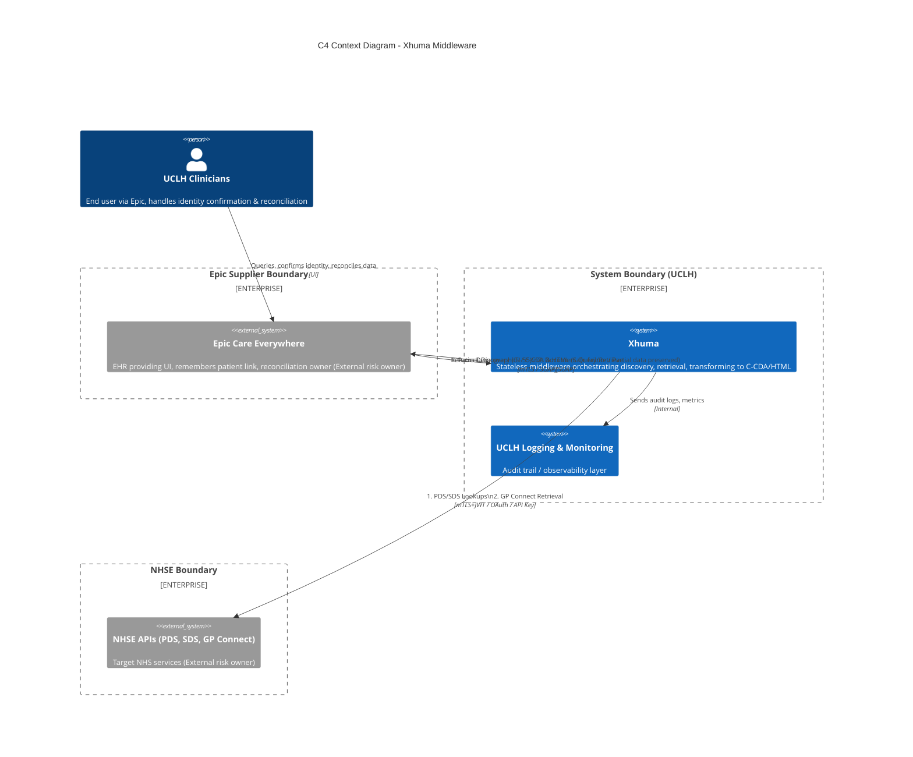
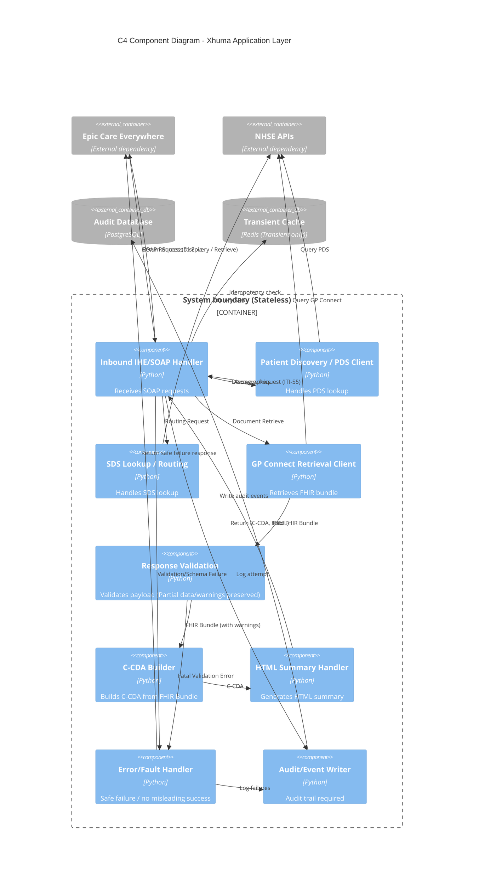
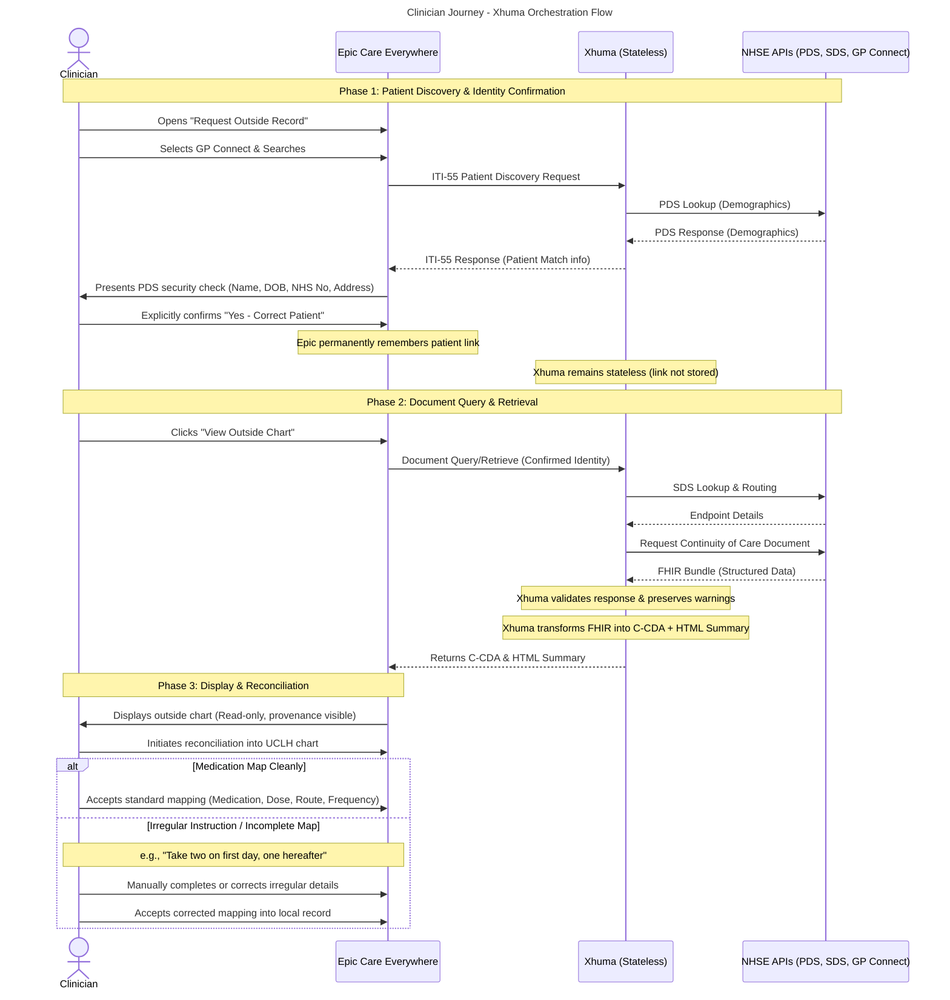

# Technical Architecture Documentation

## System Overview
Xhuma is a stateless middleware service designed to facilitate the conversion of GP Connect structured records into CCDA (Consolidated Clinical Document Architecture) format. The service acts as an intermediary between Electronic Health Record (EHR) systems and NHS APIs, providing seamless integration and data transformation capabilities.

## Architecture Diagrams

*(Note: The following diagrams align Xhuma's system model to clinical workflows and DTAC/DCB0160 assurance expectations, explicitly highlighting Epic as the system of record and Xhuma as stateless middleware.)*

### System Context


### Container Diagram
```mermaid
C4Container
    title C4 Container Diagram - Xhuma
    
    System_Ext(epic, "Epic Care Everywhere", "Reconciliation owner, stores patient linkage")
    System_Ext(nhse_api, "NHSE APIs", "PDS, SDS, GP Connect")

    System_Boundary(uclh_boundary, "System boundary (Xhuma/UCLH)") {
        
        Boundary(cicd_zone, "Engineering/Supporting System") {
            Container(cicd, "CI/CD Pipeline", "GitHub Actions & GHCR", "Config management / CI/CD controlled change")
        }

        Boundary(app_subnet, "App Service Zone (Stateless)") {
            Container(api, "Inbound IHE/SOAP Layer", "FastAPI / Docker", "Handles ITI-55 discovery & document query")
            Container(pds_handler, "Patient Discovery Handler", "Python", "PDS Lookup Orchestration")
            Container(retrieve_handler, "Document Retrieval Handler", "Python", "SDS routing & GP Connect Retrieval")
            Container(transform, "Transformation Engine", "Python", "FHIR to C-CDA & HTML mapping")
        }
        
        Boundary(db_subnet, "Protected Database Zone") {
            ContainerDb(audit_db, "Audit & Logging Component", "PostgreSQL", "Stores config & audit logs (Audit trail required)")
            ContainerDb(cache, "Transient Cache", "Redis", "Transient caching only (no durable linkage)")
        }
        
        Boundary(monitor_zone, "Observability Zone") {
            Container(monitor, "Logging Component", "Azure App Insights", "Metrics/traces (Audit trail required)")
        }
        
        Boundary(hscn_zone, "HSCN Boundary") {
            Container(hscn_relay, "HSCN Relay Agent", "WebSocket Tunnel", "Azure Private Link for HSCN integration")
        }
    }

    Rel(epic, api, "ITI-55 & Document Queries", "mTLS / Public Internet")
    Rel(api, epic, "Demographics, C-CDA, HTML", "mTLS / Public Internet")
    
    Rel(api, pds_handler, "Initiates Discovery", "Internal")
    Rel(api, retrieve_handler, "Initiates Retrieval", "Internal")
    
    Rel(pds_handler, nhse_api, "PDS Lookup", "Public Internet")
    Rel(retrieve_handler, nhse_api, "SDS Routing", "Public Internet")
    Rel(retrieve_handler, hscn_relay, "GP Connect Request", "WebSocket")
    Rel(hscn_relay, nhse_api, "GP Connect Queries", "HSCN")
    
    Rel(retrieve_handler, transform, "Passes FHIR Bundle", "Internal")
    Rel(transform, api, "Returns C-CDA & HTML", "Internal")
    
    Rel(api, cache, "Read/Write transient data", "TCP")
    Rel(api, audit_db, "Write config & audit events", "TCP")
    Rel(api, monitor, "Write metrics", "HTTPS")
    
    Rel(cicd, app_subnet, "Deploy Image Pull", "HTTPS")
```

### Component Diagram


### Data Flow Diagrams

#### DFD Level 0 (Context)
```mermaid
flowchart TD
    %% DFD Level 0
    Epic["Epic Care Everywhere\n(External dependency, remembers linkage)"]
    NHSE["NHSE APIs\n(External dependency, risk owner)"]
    Mon["UCLH Monitoring/Audit Store\n(Audit trail required)"]
    Admin["UCLH Admins"]
    Clinician["UCLH Clinicians"]
    
    Xhuma(("Xhuma\n(Stateless System boundary)"))
    
    Clinician -->|Requests Outside Record via Epic| Epic
    Clinician -->|Explicitly confirms identity| Epic
    Clinician -->|Manually reconciles| Epic
    
    Epic -->|1. Patient Discovery request| Xhuma
    Epic -->|2. Document Query/Retrieve| Xhuma
    
    Xhuma -->|PDS/SDS lookups, GP Connect retrieval| NHSE
    NHSE -->|Demographics / FHIR Bundle| Xhuma
    
    Xhuma -->|Demographics / C-CDA & HTML\n(Safe failure)| Epic
    
    Xhuma -->|audit log, metrics| Mon
    Admin -->|view logs only| Mon
```

#### DFD Level 1 (Detailed)
```mermaid
flowchart TD
    %% DFD Level 1 (Detailed View)
    classDef datastore fill:#ff9,stroke:#333;
    
    %% External Entities
    Clinician["Clinician"]
    Epic["Epic EHR\n(Stores patient link permanently)"]
    NHSE["NHSE APIs\n(PDS, SDS, GP Connect)"]
    Mon["UCLH Monitoring"]

    %% Data Stores
    StoreAudit[("Audit log store")]:::datastore
    StoreCache[("Transient Cache\n(Redis - transient only)")]:::datastore
    
    %% Discovery Scope
    P1(("1. Receive patient\ndiscovery request"))
    P2(("2. Perform PDS lookup"))
    P3(("3. Return demographics for\nhuman confirmation"))
    
    %% Retrieve Scope
    P4(("4. Receive document\nquery/retrieve request"))
    P5(("5. Perform SDS lookup/routing"))
    P6(("6. Retrieve GP Connect\nstructured data"))
    P7(("7. Validate response,\npreserve warnings"))
    P8(("8. Transform to C-CDA &\ngenerate HTML summary"))
    P9(("9. Return content"))
    
    %% Common Scope
    P10(("10. Write audit/metrics"))
    P11(("11. Handle errors safely\n(No misleading success)"))

    Clinician -->|Manual reconciliation intervention\nwhen mapping is incomplete| Epic
    Clinician -->|Human confirmation of identity| Epic
    
    Epic -->|Initiate Discovery| P1
    P1 -->P2
    P2 -->|PDS Query| NHSE
    NHSE -->|PDS Match| P2
    P2 -->P3
    P3 -->|Demographics| Epic
    
    Epic -->|Initiate Retrieval| P4
    P4 -->P5
    P5 -->|SDS Query| NHSE
    NHSE -->|Routing Info| P5
    P5 -->P6
    P6 -->|GP Connect Query| NHSE
    NHSE -->|FHIR Bundle| P6
    P6 -->P7
    P7 -->|FHIR Bundle + Warnings| P8
    P8 -->|C-CDA, HTML| P9
    P9 -->|C-CDA, HTML\n(Read-only summary + source structured data)| Epic
    
    P1 -.->|error| P11
    P4 -.->|error| P11
    P6 -.->|API error| P11
    P7 -.->|validation error| P11
    P11 -->|safe failure response| Epic
    P11 -->|alert/log| P10
    
    P1 -->|audit log| P10
    P9 -->|audit log| P10
    P10 -->|log| StoreAudit
    P10 -->|metric| Mon
    
    P2 <-->|lookups| StoreCache
    P5 <-->|endpoints| StoreCache
```

### Clinician Journey / Workflow Sequence


### Delta Summary & Assumptions

**Changes from previous version:**
- **Epic Ownership & Statelessness**: Shifted diagram labels and structures to identify Epic explicitly as the ultimate EHR UI, reconciling owner, and keeper of the patient link. Xhuma is now rigorously documented as a stateless orchestrator with cache used only for transient optimization.
- **Workflow Separation**: Separated the single unified interactions into two distinct paths: Patient Discovery (ITI-55) & Identity Confirmation, followed by Document Query & Retrieval.
- **Clinician Intervention visibility**: Updated the DFD Level 0/1 and Context diagram to show clinicians directly interacting with Epic with explicit human confirmation steps and manual reconciliation steps.
- **Observability Stack Constraint**: Pared down monitoring boxes to explicitly respect the network architecture document baseline (eliminating extrapolated components).
- **New Sequence Diagram**: Added a "Clinician Journey" sequence diagram delineating the explicit step-by-step clicks from PDS confirmation down to the reconciliation of dirty vs. clean medication texts.

**Assumptions / TBDs:**
- **TBD-01**: Identity/Auth beyond core mTLS for incoming Epic requests and clinician tracing.
- **TBD-02**: Exact granularity of UCLH telemetry observability access controls (e.g., who accesses dashboards) and role-based access logic for the Postgres audit tables.

## Core Components

### 1. API Layer (FastAPI)
- Handles incoming ITI (IHE IT Infrastructure) requests
- Manages request/response lifecycle
- Implements REST endpoints for health systems integration
- Provides async operation support for improved performance

### 2. Authentication & Security (`app/security.py`)
- Implements JWT token validation
- Manages API authentication
- Handles request signing for NHS API interactions
- Ensures secure communication channels

### 3. GP Connect Integration (`app/gpconnect.py`)
- Manages communication with GP Connect APIs
- Handles structured record retrieval
- Implements error handling and retry logic
- Maintains API version compatibility

### 4. CCDA Conversion Engine (`app/ccda/`)
- Transforms FHIR bundles to CCDA format
- Implements conversion logic for clinical data
- Manages document structure and formatting
- Handles various clinical entry types

### 5. PDS Integration (`app/pds/`)
- Manages Patient Demographic Service lookups
- Handles patient identity verification
- Implements NHS number validation
- Manages demographic data retrieval

### 6. SOAP Handler (`app/soap/`)
- Processes SOAP requests and responses
- Manages XML transformations
- Implements ITI transaction support
- Handles SOAP fault scenarios

### 7. Caching Layer (Redis)
- **Infrastructure Configuration**
  - Memory limit: 256MB with volatile-lru eviction
  - Persistence: RDB snapshots and AOF journaling
  - Network: Isolated container network
  - Security: Password authentication, protected mode

- **Client Implementation** (`app/redis_connect.py`)
  - Connection pooling with configurable limits
  - Automatic retry mechanism for resilience
  - Comprehensive error handling
  - Memory usage monitoring
  - Structured logging

- **Cache Management**
  - Intelligent key expiry
  - Memory usage monitoring
  - Cache statistics collection
  - Health checks and diagnostics

- **Data Types**
  - CCDA documents (4-hour TTL)
  - PDS lookup results (24-hour TTL)
  - SDS endpoint information (12-hour TTL)
  - NHS number mappings

## Monitoring & Observability Architecture

### 1. Metrics Collection (Prometheus)
- **Endpoint Metrics**
  - Request counts and rates
  - Response times
  - Error rates by type
  - Status code distribution

- **Cache Metrics**
  - Hit/miss rates
  - Cache size and memory usage
  - Eviction rates
  - Connection pool statistics
  - Operation latencies
  - Error counts by type

- **Resource Metrics**
  - CPU usage
  - Memory utilization
  - Network I/O
  - Disk operations

### 2. Visualization (Grafana)
- **System Dashboards**
  - Real-time performance monitoring
  - Historical trends analysis
  - Resource utilization tracking
  - Error rate visualization

- **Business Metrics**
  - Transaction success rates
  - API usage patterns
  - Cache efficiency
  - Service availability

### 3. Logging Architecture (ELK Stack)
- **Log Collection**
  - Application logs
  - System logs
  - Access logs
  - Error logs

- **Log Processing**
  - Structured log formatting
  - Log enrichment
  - Pattern detection
  - Alert generation

- **Log Storage**
  - Indexed storage
  - Retention policies
  - Archival strategy
  - Search optimization

### 4. Distributed Tracing (OpenTelemetry)
- **Trace Collection**
  - Request tracing
  - Service dependencies
  - Performance bottlenecks
  - Error propagation

- **Trace Analysis**
  - Latency analysis
  - Error tracking
  - Service mapping
  - Performance optimization

## Testing Architecture

### 1. Unit Testing
- **Test Organization**
  - Feature-based test suites
  - Integration test suites
  - Mock implementations
  - Test fixtures

- **Test Coverage**
  - Code coverage tracking
  - Branch coverage
  - Integration points
  - Error scenarios

### 2. Integration Testing
- **Service Testing**
  - API endpoint testing
  - Database interactions
  - Cache operations
  - External service mocks

- **End-to-End Testing**
  - User flow testing
  - Error handling
  - Performance validation
  - Security testing

### 3. Performance Testing
- **Load Testing**
  - Concurrent user simulation
  - Resource utilization
  - Response time analysis
  - Bottleneck identification

- **Stress Testing**
  - System limits testing
  - Recovery testing
  - Failover scenarios
  - Resource exhaustion

## Security Architecture

### 1. Authentication
- JWT-based authentication
- NHS API authentication
- Token validation and verification
- Redis password protection

### 2. Data Protection
- TLS 1.2+ for all communications
- Data encryption at rest
- Secure header handling
- Input validation and sanitization
- Redis protected mode

### 3. Compliance
- NHS Digital Standards
- NHS Supplier Conformance Assessment List: Structured Extended Testing, Spine Integration Testing, PDS onboarding
- GDPR requirements
- Health data protection regulations

## Deployment Architecture

### Container Structure
```
├── Application Container
│   ├── FastAPI Application
│   ├── Uvicorn Server
│   └── Application Dependencies
├── Redis Container
│   ├── Redis Server (v7.2)
│   ├── Custom Configuration
│   └── Persistence Volumes
└── Monitoring Stack
    ├── Prometheus
    ├── Grafana
    └── OpenTelemetry Collector
```

### Network Configuration
- Internal network for container communication
- Exposed ports:
  - 8000: Application API
  - 6379: Redis (internal only)
  - 9090: Prometheus metrics
  - 3000: Grafana dashboards

## Error Handling Architecture

### 1. Error Categories
- NHS API errors
- Conversion failures
- Authentication errors
- Network issues
- Cache operation failures

### 2. Recovery Procedures
- Automatic retries with backoff
- Connection pool management
- Error reporting
- System recovery
- Cache rebuilding

## Maintenance Architecture

### 1. Regular Maintenance
- Cache cleanup and monitoring
- Log rotation
- Performance monitoring
- Security updates
- Redis persistence management

### 2. Support Procedures
- Issue tracking
- Version control
- Documentation updates
- Dependency management

## Health Check Architecture

### 1. Liveness Probes
- Basic application health
- Critical service checks
- Resource availability
- Error rate monitoring
- Redis connection status

### 2. Readiness Probes
- Service dependencies
- Cache availability
- External service status
- Resource thresholds
- Memory usage checks

### 3. Startup Probes
- Initialization checks
- Configuration validation
- Resource allocation
- Service registration
- Redis persistence verification
