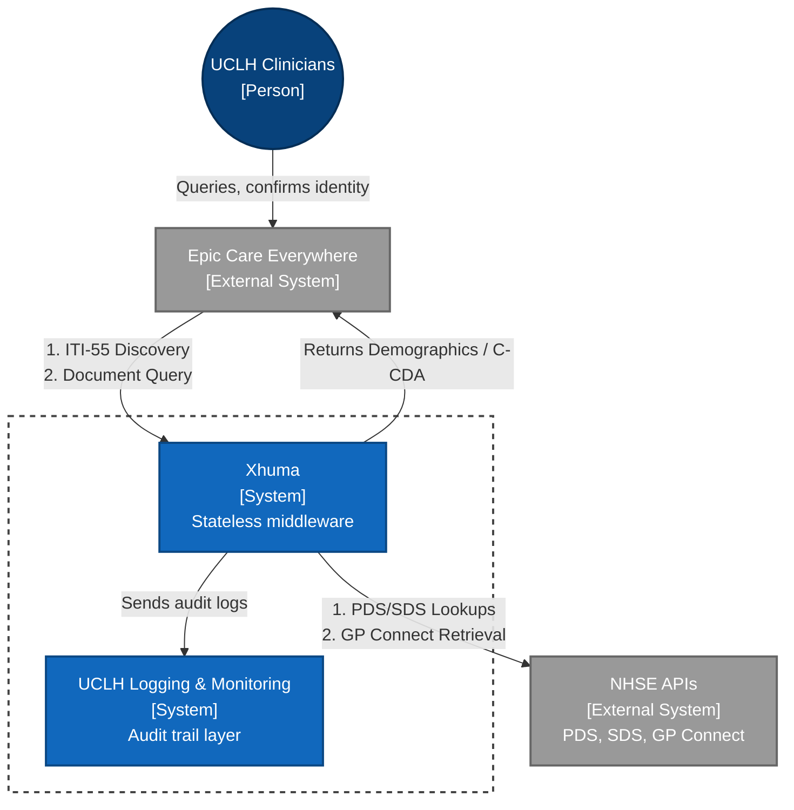
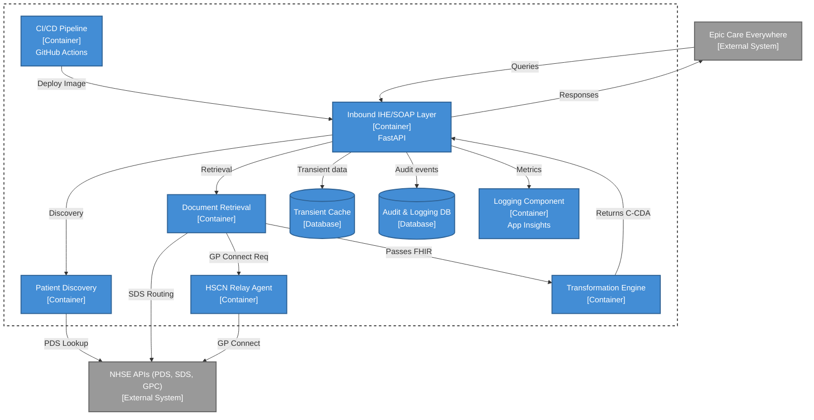
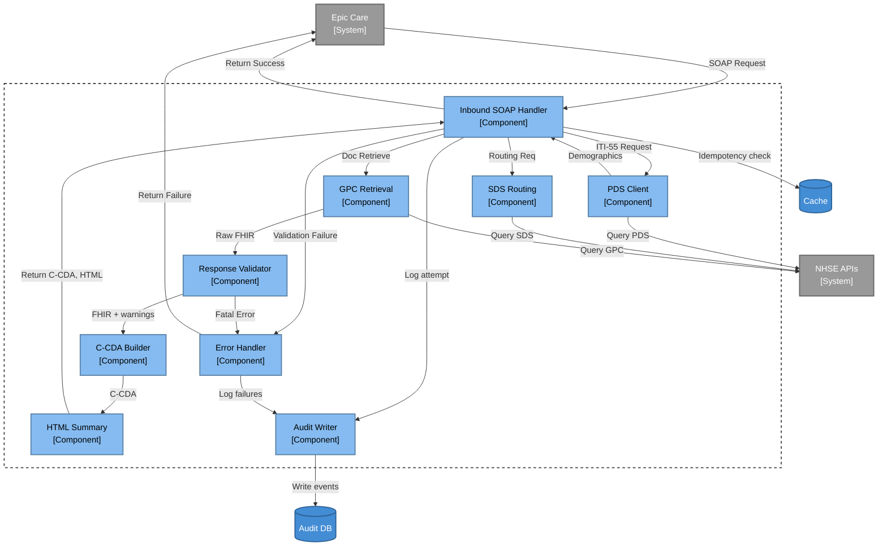
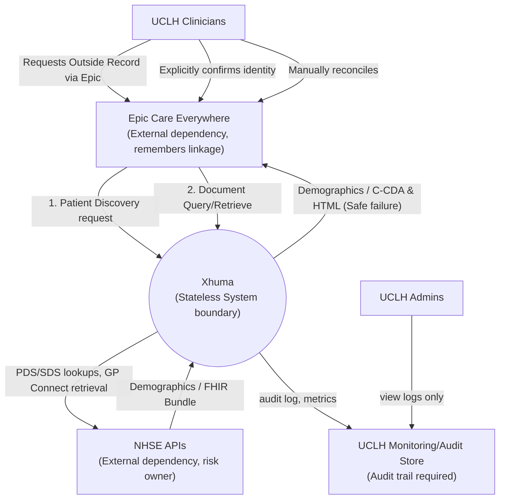
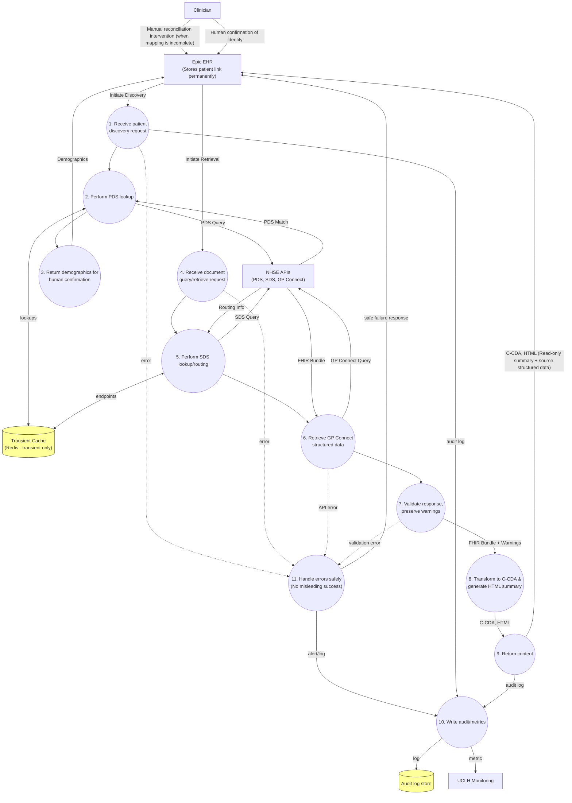
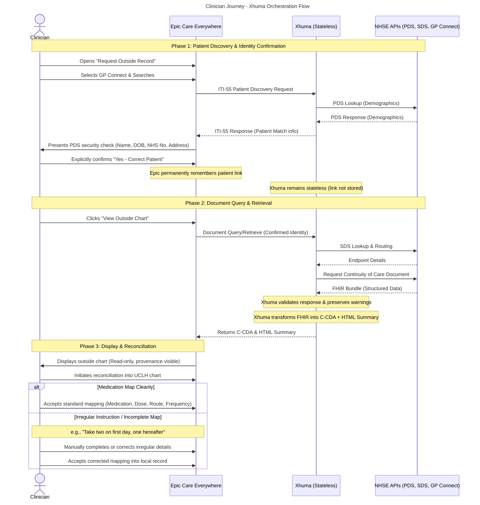

# Technical Architecture Documentation

## System Overview
Xhuma is a stateless middleware service designed to facilitate the conversion of GP Connect structured records into CCDA (Consolidated Clinical Document Architecture) format. The service acts as an intermediary between Electronic Health Record (EHR) systems and NHS APIs, providing seamless integration and data transformation capabilities.

## Architecture Diagrams

*(Note: The following diagrams align Xhuma's system model to clinical workflows and DTAC/DCB0160 assurance expectations, explicitly highlighting Epic as the system of record and Xhuma as stateless middleware.)*

### System Context

```mermaid
flowchart TD
    classDef person fill:#08427b,color:#fff,stroke:#052e56,stroke-width:2px;
    classDef system fill:#1168bd,color:#fff,stroke:#0b4884,stroke-width:2px;
    classDef ext_system fill:#999,color:#fff,stroke:#666,stroke-width:2px;
    classDef boundary fill:none,color:#fff,stroke:#444,stroke-width:2px,stroke-dasharray: 5 5;

    %% Elements
    Clinician(("UCLH Clinicians\n[Person]")):::person
    
    Epic["Epic Care Everywhere\n[External System]"]:::ext_system

    subgraph UCLHBoundary[System Boundary UCLH]
        Xhuma["Xhuma\n[System]\nStateless middleware"]:::system
        Monitor["UCLH Logging & Monitoring\n[System]\nAudit trail layer"]:::system
    end

    NHSE["NHSE APIs\n[External System]\nPDS, SDS, GP Connect"]:::ext_system

    %% Relationships
    Clinician -->|Queries, confirms identity| Epic
    Epic -->|"1. ITI-55 Discovery<br>2. Document Query"| Xhuma
    Xhuma -->|"Returns Demographics / C-CDA"| Epic
    Xhuma -->|"1. PDS/SDS Lookups<br>2. GP Connect Retrieval"| NHSE
    Xhuma -->|"Sends audit logs"| Monitor
    
    class UCLHBoundary boundary;
```

### Container Diagram

```mermaid
flowchart TD
    classDef system fill:#1168bd,color:#fff,stroke:#0b4884,stroke-width:2px;
    classDef ext_system fill:#999,color:#fff,stroke:#666,stroke-width:2px;
    classDef container fill:#438dd5,color:#fff,stroke:#2e6295,stroke-width:2px;
    classDef db fill:#438dd5,color:#fff,stroke:#2e6295,stroke-width:2px;
    classDef boundary fill:none,color:#fff,stroke:#444,stroke-width:2px,stroke-dasharray: 5 5;

    %% External Systems
    Epic["Epic Care Everywhere\n[External System]"]:::ext_system
    NHSE["NHSE APIs (PDS, SDS, GPC)\n[External System]"]:::ext_system

    %% UCLH Boundary
    subgraph UCLHBoundary[System Boundary - Xhuma / UCLH]
        CICD["CI/CD Pipeline\n[Container]\nGitHub Actions"]:::container
        API["Inbound IHE/SOAP Layer\n[Container]\nFastAPI"]:::container
        PDS["Patient Discovery\n[Container]"]:::container
        Ret["Document Retrieval\n[Container]"]:::container
        Trans["Transformation Engine\n[Container]"]:::container
        Audit[("Audit & Logging DB\n[Database]")]:::db
        Cache[("Transient Cache\n[Database]")]:::db
        Mon["Logging Component\n[Container]\nApp Insights"]:::container
        Relay["HSCN Relay Agent\n[Container]"]:::container
    end
    class UCLHBoundary boundary;

    %% Relationships
    CICD -->|Deploy Image| API
    
    Epic -->|Queries| API
    API -->|Responses| Epic
    
    API -->|Discovery| PDS
    API -->|Retrieval| Ret
    
    PDS -->|PDS Lookup| NHSE
    Ret -->|SDS Routing| NHSE
    Ret -->|GP Connect Req| Relay
    Relay -->|GP Connect| NHSE
    
    Ret -->|Passes FHIR| Trans
    Trans -->|Returns C-CDA| API
    
    API -->|Transient data| Cache
    API -->|Audit events| Audit
    API -->|Metrics| Mon
```

### Component Diagram

```mermaid
flowchart TD
    classDef ext_system fill:#999,color:#fff,stroke:#666,stroke-width:2px;
    classDef comp fill:#85bbf0,color:#000,stroke:#5b82a8,stroke-width:2px;
    classDef db fill:#438dd5,color:#fff,stroke:#2e6295,stroke-width:2px;
    classDef boundary fill:none,color:#fff,stroke:#444,stroke-width:2px,stroke-dasharray: 5 5;

    %% External
    Epic["Epic Care\n[System]"]:::ext_system
    NHSE["NHSE APIs\n[System]"]:::ext_system
    AuditDB[("Audit DB")]:::db
    Cache[("Cache")]:::db

    subgraph AppBoundary[Application Layer]
        Inbound["Inbound SOAP Handler\n[Component]"]:::comp
        PDSClient["PDS Client\n[Component]"]:::comp
        SDSClient["SDS Routing\n[Component]"]:::comp
        GPCClient["GPC Retrieval\n[Component]"]:::comp
        RespVal["Response Validator\n[Component]"]:::comp
        CCDA["C-CDA Builder\n[Component]"]:::comp
        HTML["HTML Summary\n[Component]"]:::comp
        Err["Error Handler\n[Component]"]:::comp
        AuditW["Audit Writer\n[Component]"]:::comp
    end
    class AppBoundary boundary;

    %% Relationships
    Epic -->|SOAP Request| Inbound
    Inbound -->|Return Success| Epic
    Err -->|Return Failure| Epic
    
    Inbound -->|Validation Failure| Err
    Inbound -->|Idempotency check| Cache
    Inbound -->|ITI-55 Request| PDSClient
    Inbound -->|Routing Req| SDSClient
    Inbound -->|Doc Retrieve| GPCClient
    
    PDSClient -->|Query PDS| NHSE
    SDSClient -->|Query SDS| NHSE
    GPCClient -->|Query GPC| NHSE
    
    GPCClient -->|Raw FHIR| RespVal
    PDSClient -->|Demographics| Inbound
    
    RespVal -->|Fatal Error| Err
    RespVal -->|FHIR + warnings| CCDA
    CCDA -->|C-CDA| HTML
    HTML -->|Return C-CDA, HTML| Inbound
    
    Inbound -->|Log attempt| AuditW
    Err -->|Log failures| AuditW
    AuditW -->|Write events| AuditDB
```

### Data Flow Diagrams

#### DFD Level 0 (Context)

```mermaid
flowchart TD
    %% DFD Level 0
    Epic["Epic Care Everywhere\n(External dependency, remembers linkage)"]
    NHSE["NHSE APIs\n(External dependency, risk owner)"]
    Mon["UCLH Monitoring/Audit Store\n(Audit trail required)"]
    Admin["UCLH Admins"]
    Clinician["UCLH Clinicians"]
    
    Xhuma(("Xhuma\n(Stateless System boundary)"))
    
    Clinician -->|Requests Outside Record via Epic| Epic
    Clinician -->|Explicitly confirms identity| Epic
    Clinician -->|Manually reconciles| Epic
    
    Epic -->|1. Patient Discovery request| Xhuma
    Epic -->|2. Document Query/Retrieve| Xhuma
    
    Xhuma -->|PDS/SDS lookups, GP Connect retrieval| NHSE
    NHSE -->|Demographics / FHIR Bundle| Xhuma
    
    Xhuma -->|"Demographics / C-CDA & HTML (Safe failure)"| Epic
    
    Xhuma -->|audit log, metrics| Mon
    Admin -->|view logs only| Mon
```

#### DFD Level 1 (Detailed)

```mermaid
flowchart TD
    %% DFD Level 1 (Detailed View)
    classDef datastore fill:#ff9,stroke:#333;
    
    %% External Entities
    Clinician["Clinician"]
    Epic["Epic EHR\n(Stores patient link permanently)"]
    NHSE["NHSE APIs\n(PDS, SDS, GP Connect)"]
    Mon["UCLH Monitoring"]

    %% Data Stores
    StoreAudit[("Audit log store")]:::datastore
    StoreCache[("Transient Cache\n(Redis - transient only)")]:::datastore
    
    %% Discovery Scope
    P1(("1. Receive patient\ndiscovery request"))
    P2(("2. Perform PDS lookup"))
    P3(("3. Return demographics for\nhuman confirmation"))
    
    %% Retrieve Scope
    P4(("4. Receive document\nquery/retrieve request"))
    P5(("5. Perform SDS lookup/routing"))
    P6(("6. Retrieve GP Connect\nstructured data"))
    P7(("7. Validate response,\npreserve warnings"))
    P8(("8. Transform to C-CDA &\ngenerate HTML summary"))
    P9(("9. Return content"))
    
    %% Common Scope
    P10(("10. Write audit/metrics"))
    P11(("11. Handle errors safely\n(No misleading success)"))

    Clinician -->|"Manual reconciliation intervention (when mapping is incomplete)"| Epic
    Clinician -->|"Human confirmation of identity"| Epic
    
    Epic -->|Initiate Discovery| P1
    P1 -->P2
    P2 -->|PDS Query| NHSE
    NHSE -->|PDS Match| P2
    P2 -->P3
    P3 -->|Demographics| Epic
    
    Epic -->|Initiate Retrieval| P4
    P4 -->P5
    P5 -->|SDS Query| NHSE
    NHSE -->|Routing Info| P5
    P5 -->P6
    P6 -->|GP Connect Query| NHSE
    NHSE -->|FHIR Bundle| P6
    P6 -->P7
    P7 -->|FHIR Bundle + Warnings| P8
    P8 -->|C-CDA, HTML| P9
    P9 -->|"C-CDA, HTML (Read-only summary + source structured data)"| Epic
    
    P1 -.->|error| P11
    P4 -.->|error| P11
    P6 -.->|API error| P11
    P7 -.->|validation error| P11
    P11 -->|safe failure response| Epic
    P11 -->|alert/log| P10
    
    P1 -->|audit log| P10
    P9 -->|audit log| P10
    P10 -->|log| StoreAudit
    P10 -->|metric| Mon
    
    P2 <-->|lookups| StoreCache
    P5 <-->|endpoints| StoreCache
```

### Clinician Journey / Workflow Sequence

```mermaid
sequenceDiagram
    title Clinician Journey - Xhuma Orchestration Flow
    actor C as Clinician
    participant E as Epic Care Everywhere
    participant X as Xhuma (Stateless)
    participant NHSE as NHSE APIs (PDS, SDS, GP Connect)
    
    %% Phase 1: Identity Discovery & Confirmation
    note over C, NHSE: Phase 1: Patient Discovery & Identity Confirmation
    C->>E: Opens "Request Outside Record"
    C->>E: Selects GP Connect & Searches
    E->>X: ITI-55 Patient Discovery Request
    X->>NHSE: PDS Lookup (Demographics)
    NHSE-->>X: PDS Response (Demographics)
    X-->>E: ITI-55 Response (Patient Match info)
    E->>C: Presents PDS security check (Name, DOB, NHS No, Address)
    C->>E: Explicitly confirms "Yes - Correct Patient"
    
    %% State Note
    note over E: Epic permanently remembers patient link
    note over X: Xhuma remains stateless (link not stored)
    
    %% Phase 2: Document Query & Retrieve
    note over C, NHSE: Phase 2: Document Query & Retrieval
    C->>E: Clicks "View Outside Chart"
    E->>X: Document Query/Retrieve (Confirmed Identity)
    X->>NHSE: SDS Lookup & Routing
    NHSE-->>X: Endpoint Details
    X->>NHSE: Request Continuity of Care Document
    NHSE-->>X: FHIR Bundle (Structured Data)
    
    %% Transformation & Validation
    note over X: Xhuma validates response & preserves warnings
    note over X: Xhuma transforms FHIR into C-CDA + HTML Summary
    X-->>E: Returns C-CDA & HTML Summary
    
    %% Display & Reconciliation
    note over C, E: Phase 3: Display & Reconciliation
    E->>C: Displays outside chart (Read-only, provenance visible)
    C->>E: Initiates reconciliation into UCLH chart
    
    alt Medication Map Cleanly
        C->>E: Accepts standard mapping (Medication, Dose, Route, Frequency)
    else Irregular Instruction / Incomplete Map
        note over C, E: e.g., "Take two on first day, one hereafter"
        C->>E: Manually completes or corrects irregular details
        C->>E: Accepts corrected mapping into local record
    end
```

## Security, Governance & Data Minimization

Xhuma implements strict data governance controls to align with NHS Information Governance (IG) frameworks and the National Data Sharing Arrangement (NDSA).

### Role-Based Access Control (RBAC) & Break The Glass
Xhuma relies on Epic Care Everywhere as the authoritative system of record for identity and access management. 
- **RBAC:** Only authorised clinicians with appropriate Epic security classes can initiate Xhuma queries.
- **Break The Glass:** Epic's native 'Break The Glass' functionality is enforced prior to Xhuma retrieving GP Connect data, requiring clinicians to explicitly state their reason for accessing outside records. This decision is passed back to the NHS via SAML assertions (with cryptographic issuer validation currently live in INT and rolling out across environments).

### Hardcoded Purpose of Use
Xhuma strictly enforces the `directcare` purpose. The middleware explicitly blocks any attempts to query the GP Connect API for research, secondary uses, or population health analytics.

### Data Minimization Scope
To adhere to data minimization principles, GP Connect's authorisation model requires broad patient-level read scope. Minimisation is therefore enforced at the application boundary: only the clinical domains required for safe direct care (e.g., Allergies, Medications, Immunisations) are converted and returned, explicitly excluding sensitive or unnecessary administrative data.

### Delta Summary & Assumptions

**Changes from previous version:**
- **Epic Ownership & Statelessness**: Shifted diagram labels and structures to identify Epic explicitly as the ultimate EHR UI, reconciling owner, and keeper of the patient link. Xhuma is now rigorously documented as a stateless orchestrator with cache used only for transient optimization.
- **Workflow Separation**: Separated the single unified interactions into two distinct paths: Patient Discovery (ITI-55) & Identity Confirmation, followed by Document Query & Retrieval.
- **Clinician Intervention visibility**: Updated the DFD Level 0/1 and Context diagram to show clinicians directly interacting with Epic with explicit human confirmation steps and manual reconciliation steps.
- **Observability Stack Constraint**: Pared down monitoring boxes to explicitly respect the network architecture document baseline (eliminating extrapolated components).
- **New Sequence Diagram**: Added a "Clinician Journey" sequence diagram delineating the explicit step-by-step clicks from PDS confirmation down to the reconciliation of dirty vs. clean medication texts.

**Assumptions / TBDs:**
- **TBD-01**: Identity/Auth beyond core mTLS for incoming Epic requests and clinician tracing.
- **TBD-02**: Exact granularity of UCLH telemetry observability access controls (e.g., who accesses dashboards) and role-based access logic for the Postgres audit tables.

## Core Components

### 1. API Layer (FastAPI)
- Handles incoming ITI (IHE IT Infrastructure) requests
- Manages request/response lifecycle
- Implements REST endpoints for health systems integration
- Provides async operation support for improved performance

### 2. Authentication & Security (`app/security.py`)
- Implements JWT token validation
- Manages API authentication
- Handles request signing for NHS API interactions
- Ensures secure communication channels

### 3. GP Connect Integration (`app/gpconnect.py`)
- Manages communication with GP Connect APIs
- Handles structured record retrieval
- Implements error handling and retry logic
- Maintains API version compatibility

### 4. CCDA Conversion Engine (`app/ccda/`)
- Transforms FHIR bundles to CCDA format
- Implements conversion logic for clinical data
- Manages document structure and formatting
- Handles various clinical entry types

### 5. PDS Integration (`app/pds/`)
- Manages Patient Demographic Service lookups
- Handles patient identity verification
- Implements NHS number validation
- Manages demographic data retrieval

### 6. SOAP Handler (`app/soap/`)
- Processes SOAP requests and responses
- Manages XML transformations
- Implements ITI transaction support
- Handles SOAP fault scenarios

### 7. Caching Layer (Azure Managed Redis)
- **Infrastructure Configuration**
  - Managed Azure Redis instance
  - Memory limit: 256MB with volatile-lru eviction
  - Network: Isolated via Private Endpoint/Service Endpoints
  - Security: TLS 1.2+ required, Password authentication

- **Client Implementation** (`app/redis_connect.py`)
  - Connection pooling with configurable limits
  - Automatic retry mechanism for resilience
  - Comprehensive error handling
  - Memory usage monitoring
  - Structured logging

- **Cache Management**
  - Intelligent key expiry
  - Memory usage monitoring
  - Cache statistics collection
  - Health checks and diagnostics

- **Data Types**
  - Idempotency / SOAP transactions (1-hour TTL)
  - PDS lookup results (24-hour TTL)
  - SDS endpoint information (12-hour TTL)
  - GP Connect retrieval mappings (1-minute TTL)

## Monitoring & Observability Architecture

### 1. Azure Application Insights
- **Endpoint Metrics**: Request counts, rates, response times, and failure rates.
- **Exceptions**: Stack traces and failure conditions are automatically mapped.
- **Business Metrics**: Transaction success rates, API usage patterns, and cache efficiency.

### 2. Log Analytics Workspace
- **Log Collection**: Structured application logs, system logs, and access logs.
- **Log Processing**: KQL queries for pattern detection and alert generation.

### 3. Distributed Tracing (OpenTelemetry)
- **Trace Collection**: Request tracing across the inbound API, NHS services, and cache operations.
- **Trace Analysis**: Latency analysis, error tracking, and performance optimization.

## Testing Architecture

### 1. Unit Testing
- **Test Organization**
  - Feature-based test suites
  - Integration test suites
  - Mock implementations
  - Test fixtures

- **Test Coverage**
  - Code coverage tracking
  - Branch coverage
  - Integration points
  - Error scenarios

### 2. Integration Testing
- **Service Testing**
  - API endpoint testing
  - Database interactions
  - Cache operations
  - External service mocks

- **End-to-End Testing**
  - User flow testing
  - Error handling
  - Performance validation
  - Security testing

### 3. Performance Testing
- **Load Testing**
  - Concurrent user simulation
  - Resource utilization
  - Response time analysis
  - Bottleneck identification

- **Stress Testing**
  - System limits testing
  - Recovery testing
  - Failover scenarios
  - Resource exhaustion

## Security Architecture

### 1. Authentication
- JWT-based authentication
- NHS API authentication
- Token validation and verification
- Redis password protection

### 2. Data Protection
- TLS 1.2+ for all communications
- Data encryption at rest
- Secure header handling
- Input validation and sanitization
- Redis protected mode

### 3. Compliance
- NHS Digital Standards
- NHS Supplier Conformance Assessment List: Structured Extended Testing, Spine Integration Testing, PDS onboarding
- GDPR requirements
- Health data protection regulations

## Deployment Architecture

### Azure Infrastructure (Shared-Nothing Terraform)
- **App Service**: Linux Web App running the FastAPI Docker container
- **Azure Cache for Redis**: Managed Redis instance
- **Key Vault**: Secure storage for secrets, certificates, and JWT keys
- **Application Insights**: Dedicated observability workspace

### Multi-Trust Matrix Deployment
The deployment pipeline uses Terraform to orchestrate entirely isolated "shared-nothing" environments for each NHS Trust. While infrastructure is completely segregated, all Trusts authenticate to the NHS Spine using a unified JWKS hosted on a centralized Azure Blob Storage account.

### Network Configuration
- Internal Azure Virtual Network (VNet) integration for outbound traffic
- Inbound traffic secured via Azure App Service Front Door (mTLS enabled)
- Isolated Private Endpoints for Redis and PostgreSQL

## Error Handling Architecture

### 1. Error Categories
- NHS API errors
- Conversion failures
- Authentication errors
- Network issues
- Cache operation failures

### 2. Recovery Procedures
- Automatic retries with backoff
- Connection pool management
- Error reporting
- System recovery
- Cache rebuilding

## Maintenance Architecture

### 1. Regular Maintenance
- Cache cleanup and monitoring
- Log rotation
- Performance monitoring
- Security updates
- Redis persistence management

### 2. Support Procedures
- Issue tracking
- Version control
- Documentation updates
- Dependency management

## Health Check Architecture

### 1. Liveness Probes
- Basic application health
- Critical service checks
- Resource availability
- Error rate monitoring
- Redis connection status

### 2. Readiness Probes
- Service dependencies
- Cache availability
- External service status
- Resource thresholds
- Memory usage checks

### 3. Startup Probes
- Initialization checks
- Configuration validation
- Resource allocation
- Service registration
- Redis persistence verification
